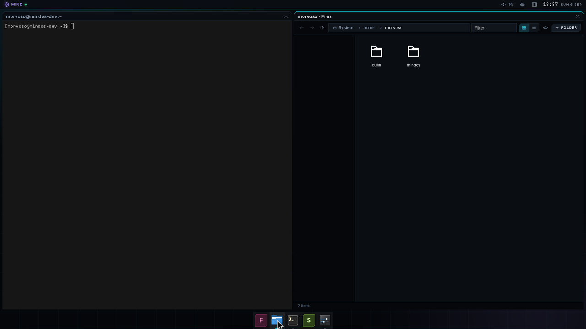
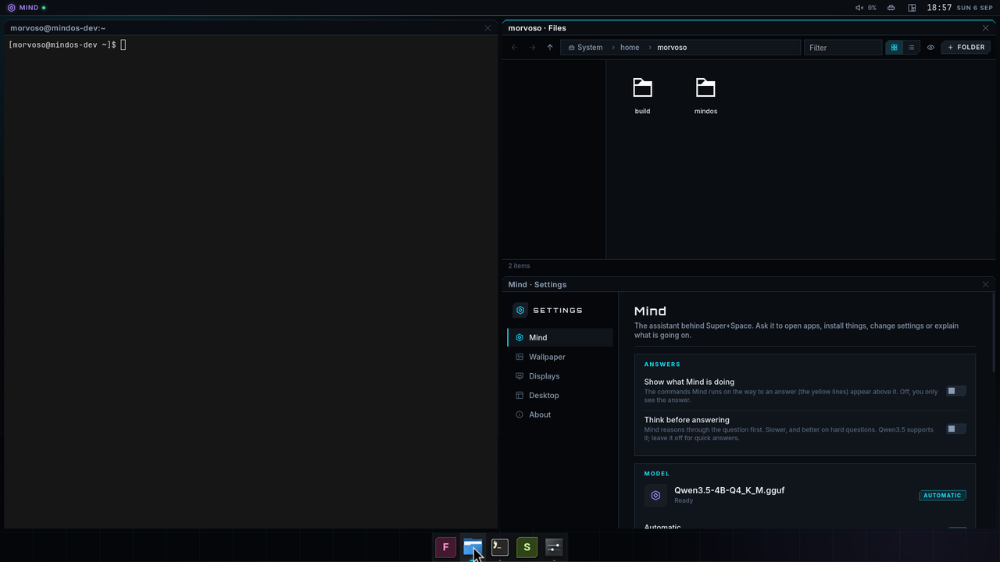

# mindwm — the MindOS compositor

`mindwm` is the Wayland compositor MindOS boots into. It is a fork of
[Smithay](https://github.com/Smithay/smithay)'s reference compositor
(`anvil`, Smithay 0.7) with MindOS behaviour layered on top:

* **DRM/KMS session** via libseat/logind, libinput, GBM + EGL/GLES (NVIDIA
  and Mesa both work through the normal Linux driver stack), multi-GPU aware,
  direct scanout for fullscreen games. `--winit` runs it nested for development.
* **XWayland** built in, so X11 games and launchers (Steam, Proton/Wine, Lutris)
  run unchanged.
* **Three window layouts**, switched from the shell's top bar (the icon next
  to the clock), with `Super+T`, or in Settings › Desktop, and remembered
  across sessions: *Floating* (like KDE: windows keep their size, open
  centred and cascade, drag them by the title bar), *Tiles* (like Hyprland's
  dwindle layout: every new window splits the focused tile) and *Columns*
  (like Niri: windows line up on a strip that scrolls sideways). Dialogs
  always float, centred over their parent. Fullscreen requests get direct
  scanout.
* **Server-side decorations in the MindOS look**: a 30 px translucent title
  bar with rounded top corners, the window title and minimise / maximise /
  close glyphs, a cyan line under the bar of the focused window. Drawn for every toplevel that negotiates
  server-side decorations through xdg-decoration (Qt, foot, SDL/libdecor,
  Chromium, Firefox, ...), for X11 windows that are not undecorated, and for
  the shell's own app windows (`mindos-*` app ids). GTK applications keep the
  bars they draw themselves, like on KDE and GNOME.
* **Dark glass theme.** The desktop is the MindOS void (`#05070a`) with
  off-white text (`#e6edf3`) and one electric-cyan accent (`#19e3ff`); the
  Mind bar and the title bars are rounded, translucent dark cards with a
  light hairline and a soft accent glow (`docs/THEME.md`). Red is reserved for the kernel console, the boot menu and
  the boot stages and never appears in the session. When no window is open
  the `MINDOS` wordmark (Orbitron) and the key hints are drawn behind
  everything.
* **The Mind bar** (`Super+Space`): a software-rendered overlay that is both an
  application launcher and the front end of `mindd`, the local LLM daemon.
* **A shell IPC socket** (`MINDWM_SOCKET`) through which `mindshell`, the
  HTML/TypeScript desktop, lists and drives windows; see `docs/SHELL.md`.

## Focus

Game mode means no clicking around: a window that maps (Wayland or X11) gets
keyboard focus immediately, and when the focused window closes or crashes the
top-most remaining window takes over. Clicking a window still focuses and
raises it; `Super+Tab` cycles.

Layer-shell surfaces (the shell's panels, popups, wallpaper) follow the
usual rules: a `top`/`overlay` surface with *exclusive* keyboard
interactivity gets every key (the Mind bar popup), one with *on-demand* gets
the keyboard the moment it appears and whenever it is clicked (a context
menu or the layout picker can be dismissed with Escape straight away), and
one with *none* (a plain panel) never takes focus, and clicking it does not
hand the focus to the window underneath either. `bottom`/`background`
surfaces only get focus when clicked and set to on-demand, so clicking the
wallpaper does not steal the keyboard from a game. When a popup that held the
keyboard goes away, the top-most window gets it back, so a question to Mind
does not leave the terminal deaf.

The pointer is re-aimed once per event-loop turn: when a panel maps, a popup
disappears or a window closes under a pointer that has not moved, the next
click still lands on whatever is there now.

Windows can be **minimised** through the IPC (the taskbar): a minimised window
leaves the space, so it is not rendered, gets no input and no frame callbacks
(a minimised game stops rendering), and comes back where it was, on top and
focused. A fullscreen window that is minimised gives its output's direct
scanout back and takes it again when restored.

**Maximised means the usable area**: the output minus the exclusive zones of
layer-shell panels. When a panel appears, resizes or goes away, every
maximised window on that output is re-fitted, and fullscreen windows keep
covering the whole output (panels are not drawn over a fullscreen window).

## Window layouts and decorations

`src/layout.rs` owns the three modes; the current one is saved in
`$XDG_STATE_HOME/mindos/mindwm.json` (`src/prefs.rs`, with the other
preferences the shell edits: whether the Mind bar shows its tool lines, the
primary output, per-output settings) and announced to the shell as a
`layout_mode` event.

* **Floating** (`floating`, like KDE). Every window keeps the size it asks
  for and opens centred on the output it appears on; a second window that
  would land on the first is cascaded 40 px down and right. Drag by the title
  bar to move, `Super+M` maximises to the usable area (the output minus the
  panels), `Super+F` fills the screen. `[layout].open_maximized = true`
  brings back the old game mode where every new window opens maximised.
* **Tiles** (`dwindle`, like Hyprland). Every window is a tile; a new one
  splits the focused tile along its longer side, so windows spiral inwards.
  `Super+arrows` move the focus, `Super+Shift+arrows` swap tiles,
  `Super+Shift+F` floats the focused window (and tiles it again).
* **Columns** (`columns`, like Niri). Windows are columns on an endless strip
  that scrolls sideways to keep the focused one in view; `Super+R` cycles a
  column through a third, a half, two thirds and the full width.

`Super+T` cycles the modes. Tiling modes keep `gap` pixels between tiles and
`outer_gap` from the edge of the usable area. Dialogs (toplevels with a
parent, X11 transient and utility windows) float in every mode, centred over
their parent. Maximised and fullscreen windows leave the tiling while they
are maximised.




In the two tiling modes the layout owns every tile's place and size, so a
tile's title bar carries only the close glyph (no minimise, no maximise, no
double-click to maximise; `Super+Shift+F` floats the window, which brings
the full set back). The columns strip does not jump:
when the focus moves to a column that is off-screen or half visible, from a
click, `Super+Left/Right`, a new window or the dock, the strip slides there
in 260 ms (ease-out, recomputed every frame). Clicking a dock icon of a
running app focuses that window; in floating mode a second click minimises
it, in the tiling modes tiles are never minimised.

The title bar (`src/shell/ssd.rs`) is rendered on the CPU with the same
tokens and fonts as the shell and only redrawn when its title, focus, hover
or width changes; drag it to move the window, double-click to maximise
(floating windows), and the glyphs on the right minimise, maximise and close
(close only on a tile). A window that asks for
client-side decorations gets none from the compositor; one that never asks
gets none either, except the shell's app windows (`mindos-settings`), which
open undecorated so they get the same bar as
everything else. `Super+Shift+D` toggles the decoration mode of the focused
window.

## Keybindings

| Keys | Action |
|------|--------|
| `Super` (tap, nothing else pressed) | Open the Mind bar: Mind is the launcher |
| `Super+Space` | Open/close the Mind bar |
| `Super+W` | The shell's overview (`shortcut overview`); the built-in window preview when no shell is connected |
| `Super+Enter` | Terminal (`[apps].terminal`, default `foot`) |
| `Super+Q` | Close the focused window |
| `Super+F` | Toggle fullscreen on the focused window |
| `Super+M` | Toggle maximize on the focused window |
| `Super+T` | Next window layout (floating → tiles → columns) |
| `Super+Shift+F` | Float / tile the focused window (tiling modes) |
| `Super+R` | Cycle the width of the focused column (columns mode) |
| `Super+←↑↓→` | Focus the window in that direction |
| `Super+Shift+←↑↓→` | Move (swap) the focused window in that direction |
| `Super+Tab` / `Alt+Tab` | Cycle windows |
| `Super+1..9` | Move the pointer to output *n* |
| `Super+Shift+D` | Toggle server/client-side decorations on the focused window |
| `Super+Shift+E`, `Ctrl+Alt+Backspace` | Quit the compositor (ends the session) |
| `Ctrl+Alt+F1..F12` | Switch virtual terminal |
| `Super+Shift+P` / `Super+Shift+M` | Output scale up / down |
| `Super+Shift+R` | Rotate the output under the pointer |
| `Super+Shift+W` | Built-in window preview (all windows scaled side by side) |

Only `Super` combinations are consumed by the compositor; games see every
other key unmodified, and clients that use the keyboard-shortcuts-inhibit
protocol get everything.

## The Mind bar

* Type to filter installed applications (XDG desktop entries from
  `$XDG_DATA_DIRS`); `Enter` launches the highlighted one, `↑`/`↓`/`Tab` select.
* Anything that is not an application, a query prefixed with `?`, or
  `Shift+Enter`, is sent to Mind. The answer streams in; tool calls show as
  `⚙ run: nvidia-smi`, results as `✓ run_command: …`.
* When Mind wants to change the system (install packages, restart a service,
  edit a config) and autopilot is off, the bar shows *Mind wants to: …* and
  waits for `Y` or `N`. The daemon's policy layer decides what needs confirmation
  and what is forbidden outright; see `docs/ARCHITECTURE.md`.
* `!command` runs a shell command in the session. `Esc` cancels a running
  answer, then closes the bar. `Ctrl+L` clears the conversation.
* Mind can act inside the session through *client tools* the compositor
  registers on connect: `launch_app`, `open_terminal`, `run_in_terminal`.

The bar talks to `mindd` over `/run/mindos/mind.sock` (newline-delimited JSON,
see `mindd/src/proto.rs`). If the daemon is not running the bar still works as a
launcher and says so in its status line; it reconnects automatically.

## The shell IPC

`mindshell` (and anything else in the session) talks to the compositor over
`$XDG_RUNTIME_DIR/mindwm-<wayland socket>.sock`, exported as `MINDWM_SOCKET`
to every program mindwm starts and imported into `systemd --user` by
`session-startup`. Newline-delimited JSON, one request per line, replies echo
the request's `id`; subscribers get `windows`, `outputs`, `layout_mode`,
`prefs`, `shortcut`, `mindbar` and `mind_status` events, and can change the
layout mode, the preferences and the outputs (mode, scale, position,
rotation, VRR, primary) from the Settings app. The full request/event tables are in `docs/SHELL.md`
("The compositor IPC"); `src/ipc.rs` implements them.

* Window ids are stable for the life of a window and follow creation order.
  Override-redirect X11 windows (menus, tooltips) and toplevels that have not
  drawn yet are not listed.
* Snapshots are compared after every event-loop turn and only sent when a
  listed field changed, so an idle desktop costs nothing.
* A stalled subscriber (4 MiB of unread events) or one that sends a line over
  64 KiB is disconnected.

Try it by hand:

```sh
printf '{"id":1,"type":"subscribe"}\n{"id":2,"type":"terminal"}\n' | socat - UNIX-CONNECT:"$MINDWM_SOCKET"
```

## Configuration

`/etc/mindos/mindwm.toml`, overlaid by `~/.config/mindos/mindwm.toml`
(and `$MINDWM_CONFIG`):

```toml
[startup]
# spawned through `sh -c` once the Wayland socket and XWayland are up;
# WAYLAND_DISPLAY and DISPLAY are set in their environment
exec = ["/usr/lib/mindos/session-startup"]

[apps]
terminal = "foot"

[layout]
mode = "floating"        # floating | dwindle | columns (the saved choice wins)
gap = 8                  # pixels between tiles
outer_gap = 8            # pixels between the tiles and the usable area
open_maximized = false   # floating mode: open every new window maximised

[mind]
socket = "/run/mindos/mind.sock"
autopilot = false      # true: apply "change" actions without asking

[theme]
background = "#05070a"   # the MindOS void
foreground = "#e6edf3"
accent = "#19e3ff"       # Mind bar lines, selection, wordmark glow
show_wordmark = true

[session]
kiosk = false            # true for the login screen (mindos-greeter): no Mind bar,
                         # no launcher, no shortcut/IPC that starts a program
```

`MIND_SOCKET` in the environment overrides `[mind].socket`; `MINDWM_CONFIG`
names one more file loaded last (the greeter uses
`/etc/mindos/greeter/mindwm.toml`).

## Layout of the sources

| File | What it does |
|------|--------------|
| `src/main.rs` | Backend selection (`--tty-udev` on a TTY, `--winit` nested, auto-detected) |
| `src/config.rs` | Config loading and merging |
| `src/mindbar.rs` | Mind bar state machine and CPU rendering (panel, results, conversation, desktop backdrop) |
| `src/text.rs` | fontdue text rasteriser into premultiplied BGRA memory buffers; embedded Inter (body and labels), JetBrains Mono, Orbitron (display) and DejaVu Sans (glyph fallback); macOS-style compositing (gamma-corrected coverage, subpixel glyph placement); anti-aliased rounded rectangles, chamfered rectangles and glow lines |
| `src/ipc.rs` | The shell IPC socket: framing, request/event types, calloop wiring, request handlers |
| `src/launcher.rs` | Desktop-entry index and ranking |
| `src/mind.rs` | Threaded client for `mindd`; events arrive through a calloop channel |
| `src/edid.rs` | Minimal EDID parser for output make/model (replaces libdisplay-info) |
| `src/layout.rs` | The three window layouts: tile order per output, dwindle and column geometry, focus/move by direction, floating toggles |
| `src/prefs.rs` | Preferences the shell edits (`$XDG_STATE_HOME/mindos/mindwm.json`): layout mode, Mind tool lines, primary output, per-output settings |
| `src/shell/mod.rs` | New-window placement (`initial_state`, `centered`, `cascade`, `pointer_output_area`), usable-area relayout when layer-shell exclusive zones change |
| `src/shell/ssd.rs` | Server-side decorations: the title bar renderer and its pointer handling |
| `src/shell/xdg.rs`, `src/shell/x11.rs` | xdg-shell and XWayland window management |
| `src/input_handler.rs` | Keybindings (`process_keyboard_shortcut`), the Super tap, layer focus rules and Mind bar key routing |
| `src/render.rs` | Output element assembly: cursor, Mind bar overlay, windows, wordmark backdrop |
| `src/udev.rs`, `src/winit.rs` | DRM/KMS and nested backends (from anvil) |

## Development

```sh
cd mindwm
cargo build --release
# nested, inside any Wayland/X11 session; talks to a test daemon if MIND_SOCKET is set
MIND_SOCKET=/run/user/1000/mind-test.sock ./target/release/mindwm --winit
# preview the Mind bar and desktop backdrop rendering without a display
# (writes bar-empty/bar-launcher/bar-chat/desktop .ppm files)
MINDWM_PREVIEW_DIR=/tmp/preview cargo test --release --lib renders_preview
# IPC framing/reply/socket unit tests
cargo test --release --lib ipc
```

For a nested run without the MindOS session scripts, point `MINDWM_CONFIG`
at a file with `[startup] exec = []` and your terminal in `[apps]`; the IPC
socket then appears as `$XDG_RUNTIME_DIR/mindwm-wayland-<n>.sock`.

## GPUs, software rendering and virtual machines

On a real boot mindwm picks the udev "primary" GPU (the boot VGA device), keys
its renderer by that device's render node and drives every other DRM device
(iGPU, DisplayLink, ...) by rendering on the primary and copying frames over.
If the primary device has no hardware-accelerated EGL implementation (a VM
with `virtio-vga` and no virgl, or a GPU without a Mesa driver), mindwm falls
back to Mesa's software rasterizer on that device instead of refusing to
start; the journal then says `rendering with Mesa software rasterizer`. If
the udev choice cannot be initialised at all, the first device that did come
up becomes the primary. Clients get no dmabuf/`wl_drm` in software mode and
use `wl_shm`, which is fine for terminals and the installer.

Set `ANVIL_DRM_DEVICE=/dev/dri/cardN` in the session environment to force a
specific device.

## Boot hand-over

`greetd.service` gets a drop-in from `mindos-session`
(`/usr/lib/systemd/system/greetd.service.d/mindos.conf`) so the hand-over from
the Plymouth splash to the compositor never shows the red kernel VT. Upstream
greetd is ordered after `plymouth-quit-wait.service`, so Plymouth would restore
the text VT before the session starts. The drop-in conflicts with
`plymouth-quit.service`/`plymouth-quit-wait.service` and starts right after
`plymouth-start.service`; before greetd starts it runs `plymouth deactivate`
(plymouthd drops DRM master but the splash stays on screen, so mindwm never
races it for the display) and `/usr/lib/mindos/greetd-vt`, which turns tty1
into white-on-void. That matters because greetd resets its VT to text mode and
clears it before every session: the cleared console is what is visible between
the splash and mindwm's first frame, and it is now the same dark colour as the
desktop instead of boot red. Once greetd is up, `plymouth quit --retain-splash`
ends plymouthd. If greetd fails, `plymouth-quit.service` runs (`OnFailure=`) so
the console is reachable.

greetd's greeter is `mindos-greeter`: this compositor in kiosk mode showing
`mindshell --app greeter`, the MindOS login screen (see docs/SHELL.md, *The
login screen*). It runs as the `greeter` user, so a compositor crash there
simply restarts the login screen.

## Debugging on the live ISO

* `journalctl -t mindwm` has the compositor log (`mindos-session` pipes it
  through `systemd-cat`).
* `ls $XDG_RUNTIME_DIR/mindwm-*.sock` shows the shell IPC socket; `socat` or
  `nc -U` and a `{"type":"get_windows"}` line show what the shell sees.
* `Ctrl+Alt+F2` is a root shell on the live ISO; in QEMU with
  `-serial file:...` anything redirected to `/dev/ttyS0` lands in that file.
* A crash drops back to greetd, which shows the MindOS login screen on VT 1
  (`journalctl -t mindos-greeter` for its compositor, `journalctl -t
  mindshell` for the page). greetd only runs the autologin `initial_session`
  once per boot; to re-run it after fixing something, `rm /run/greetd.run &&
  systemctl restart greetd`; without the `rm` the restart shows the login
  screen.
* A VT switch pauses the session: rendering stops until the VT comes back
  (no repaint retries while inactive).
* To try a new build without rebuilding the ISO, ship the stripped binary
  on a second disk (`mke2fs -q -F -t ext4 -d dir img`, attached as
  `/dev/vdb`) and from the root shell run `mount /dev/vdb /mnt && cp
  /mnt/mindwm /usr/bin/mindwm.new && mv -f /usr/bin/mindwm.new
  /usr/bin/mindwm`, then restart greetd as above. Copy-then-rename matters:
  copying straight over the running binary fails with "Text file busy" and
  leaves the old one in place, so check `md5sum /usr/bin/mindwm`.
