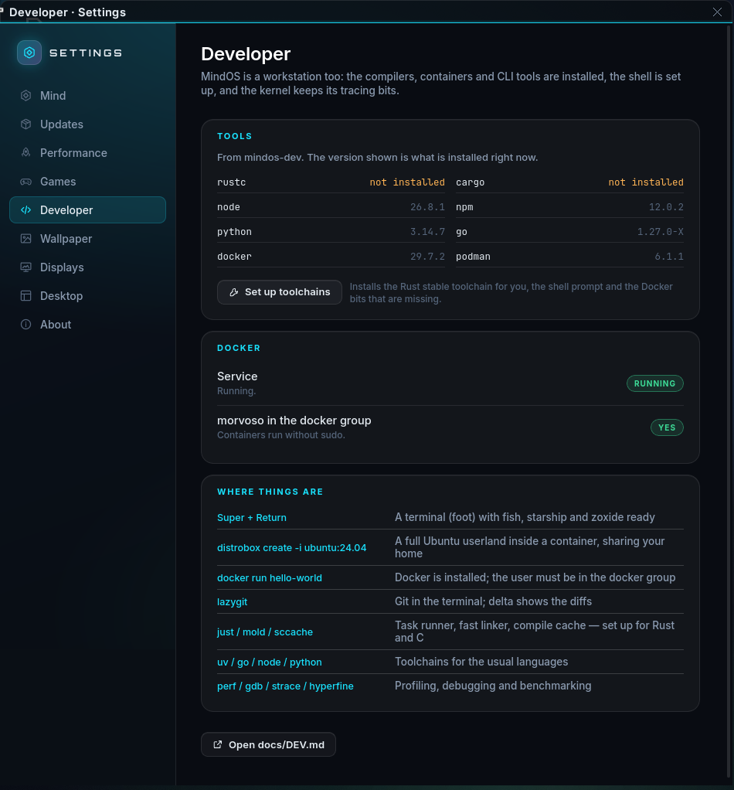

# Developing on MindOS

`mindos-dev` (`packages/mindos-dev/`) is the developer stack. It is a meta
package: the tools come from the Arch repositories, and the package adds a
shell prompt, git defaults, kernel limits and a setup command. None of it runs
until a shell is opened. New installs leave Docker disabled until it is
enabled from Settings › Developer or `mindos-dev-setup`; installing the
developer tools alone does not add a background container daemon.

The package is language-neutral. It installs the components most projects
need (a C toolchain, a build system, a debugger, git, containers, an editor)
and four common runtimes. Any other toolchain is one command
(`mindos-pkg install dotnet-sdk`) or one click in Settings › Developer, and
the system treats it the same as the ones installed by default.

## Contents

| Area | Packages |
| --- | --- |
| Compilers and build | base-devel, linux-mindos-headers (external kernel modules), clang/llvm/lld, cmake, ninja, mold (linker), sccache (compilation cache), just (task runner) |
| Runtimes | rustup (Rust), nodejs + npm, python + pip + uv, go |
| Git and remotes | git, git-lfs, github-cli, lazygit, git-delta, difftastic, openssh |
| Debugging and profiling | gdb, lldb, strace, ltrace, perf, valgrind, hyperfine, tokei |
| Containers | docker + docker-compose, podman, distrobox |
| Editors and terminals | neovim, VS Code (`code`, the Code - OSS build), kitty, tmux |
| Shell | fish, zsh, starship, zoxide, direnv, fzf, shellcheck, man-db + man-pages, tldr |
| File and system utilities | ripgrep, fd, bat, eza, jq, sd, dust, duf, btop, bottom, htop, nvtop |

Tools come from Arch; matching kernel headers come from the MindOS repository.
`mindos-pkg info NAME` or `pacman -Qi NAME`
describes a tool, and `mindos-pkg install NAME` installs anything not listed,
from the repositories or Flathub. The AUR is disabled by default and requires
an explicit `--aur`; see `docs/PACKAGES.md`.

## Settings › Developer

The page reports the toolchains detected on the system and manages the steps
a package installation cannot perform:

* **Toolchains**: what is installed, with versions. A selector installs a
  common toolchain through `mindos-pkg install --repo-only`, which reaches
  only the Arch repositories, never Flathub or the AUR (`docs/PACKAGES.md`).
  The package list and the `--repo-only` flag are both fixed in the shell's
  command allow-list; the page cannot change them. Anything outside that list
  is installed with `mindos-pkg install NAME` in a terminal.
* **Containers**: the Docker service and the `docker` group. Podman requires
  no setup.
* **SSH**: the user's key (created here if none exists; the public key can be
  displayed and copied to a git host), and the `sshd` service, which accepts
  remote logins. It is disabled until enabled here.
* **Access**: the groups that grant access to devices and services without
  sudo (`docker`, `kvm`, `libvirt`, `uucp` for serial ports, `wireshark`),
  and the current values of the kernel limits set by `61-mindos-dev.conf`.
* **Git identity**: the name and email address recorded on commits.

Every privileged action runs through `pkexec`, so the shell's authentication
dialog requests the password. No terminal is involved.

## First run



```
mindos-dev-setup
```

The command performs the per-user steps only. It can be run repeatedly; steps
that are already complete are skipped.

* Rust: `rustup default stable` and the `rust-analyzer`, `clippy` and
  `rustfmt` components. rustup stores toolchains per user, so a package
  cannot install them. Skipped when rustup is not installed.
* Docker: enables and starts `docker.service` and `docker.socket` and adds
  the user to the `docker` group, through `sudo`. Each sudo step is announced
  before the password prompt. The group change takes effect at the next
  login. Podman is rootless and requires no setup.
* SSH: offers to create an ed25519 key when `~/.ssh` contains none.
* VS Code: writes `~/.config/Code - OSS/User/settings.json` when none exists
  (Default Dark Modern theme, JetBrains Mono with ligatures, custom title bar,
  format-on-save off, telemetry off).
* git: prompts for `user.name` and `user.email` when they are not set and a
  terminal is attached.

No toolchain other than the Rust one is installed by this command.

`mindos-dev-setup --status` reports the state of the system: every language
toolchain it can detect, the build and debug tools, group memberships, and the
Docker and SSH services. Only installed toolchains are listed. The probe list
is wider than the set `mindos-dev` installs, so toolchains added later are
reported in the same way. `--status --json` produces the same report as JSON,
which is what Settings › Developer reads:

```json
{"toolchains":[{"name":"Rust","cmd":"rustc","version":"1.98.1"},
               {"name":".NET","cmd":"dotnet","version":"10.0.111"}],
 "tools":[{"name":"git","cmd":"git","version":"2.55.0"}],
 "docker":{"installed":true,"active":true,"enabled":true,"member":true},
 "podman":{"installed":true},
 "ssh":{"installed":true,"active":false,"enabled":false,"port":22,
        "new_key":"/home/you/.ssh/id_ed25519",
        "keys":[{"path":"/home/you/.ssh/id_ed25519.pub","type":"ED25519","comment":"you@host"}]},
 "groups":[{"name":"docker","help":"Run Docker containers without sudo","member":true}],
 "limits":{"inotify_watches":1048576,"inotify_instances":1024,"perf_paranoid":1},
 "git":{"name":"You","email":"you@example.com"},
 "user":"you"}
```

To add a language to the report, add a line to `TOOLCHAINS` in
`packages/mindos-dev/mindos-dev-setup` (`label|command|version argument`). To
make it installable from the Settings selector, add the package to
`CATALOGUE` in `mindshell/ui/src/apps/settings-dev.ts` **and** to
`DEV_PACKAGES` in `mindshell/src/app.rs`, the host's allow-list for that
button.

## The shell

fish is the default shell. `/etc/fish/conf.d/mindos-dev.fish` is sourced by
every interactive fish session and configures:

* **starship** with the MindOS prompt (`/etc/mindos/dev/starship.toml`): the
  current directory (cyan), the git branch (violet), the repository state
  (amber: `!` modified, `+` staged, `?` untracked, `⇡2` ahead, a rebase in
  progress), the Rust/Node/Python/Go version inside such a project, the
  duration of commands that took 2 s or longer, and the exit code of a failed
  command (pink); then a prompt character, green after success and pink after
  a failure. A `~/.config/starship.toml` takes precedence when present.
* **zoxide**: `z NAME` changes to a previously visited directory; `zi`
  selects one with fzf.
* **direnv**: a `.envrc` in a project is loaded on entering the directory and
  unloaded on leaving it (`direnv allow` on first use).
* **fzf**: Ctrl-R searches history, Ctrl-T files, Alt-C directories.
* `ls`, `ll`, `la` run eza with icons and directories first (`ll` adds git
  status); `cat` runs bat without a pager; `lg` runs lazygit. `command ls`
  and `command cat` run the originals. `EDITOR` is nvim unless already set.
* `mindos` lists the MindOS commands (the Mind, `mindos-pkg`, `mindos-perf`,
  `mindos-boot`, ...).

zsh receives the same configuration from `/etc/mindos/dev/zshrc`. Add to
`~/.zshrc`:

```sh
[ -r /etc/mindos/dev/zshrc ] && source /etc/mindos/dev/zshrc
```

bash is not modified. All of these files are listed in `backup=()`, so local
edits survive package upgrades; a changed default arrives as a `.pacnew`.

## git

`/etc/gitconfig` includes `/etc/mindos/dev/gitconfig`. `~/.gitconfig`
overrides both, and `git config --global` never writes to the system files.

| Setting | Effect |
| --- | --- |
| `init.defaultBranch = main` | new repositories start on `main` |
| `core.pager = delta` | diffs, logs and blame are displayed through delta: syntax highlighting (TwoDark), line numbers, `n`/`N` to move between files, clickable file links; removed lines are tinted pink, added lines green |
| `merge.conflictstyle = zdiff3` | conflict markers include the common ancestor |
| `diff.colorMoved`, `diff.algorithm = histogram` | moved blocks in a separate colour, cleaner hunks |
| `pull.rebase`, `rerere.enabled` | pulls rebase instead of merging; resolved conflicts are remembered |
| `push.autoSetupRemote`, `fetch.prune` | the first push of a branch sets the upstream; deleted remote branches are pruned |
| `git dft` | a structural diff with difftastic instead of a line diff |

## Containers

* **Docker** for compose stacks and images intended for distribution.
  `mindos-dev-setup` or Settings › Developer enables the daemon. Until the
  user is in the `docker` group, `docker` fails with "permission denied";
  this indicates the missing group membership, not a broken installation.
* **Podman** is installed alongside Docker. It is rootless and has no daemon,
  and accepts the same commands as `docker` in most cases.
* **distrobox** runs another distribution's toolchain in a container that
  shares the home directory, display and devices, on top of Podman:

  ```
  distrobox create -n ubuntu -i ubuntu:24.04
  distrobox enter ubuntu          # apt install the project's dependencies
  distrobox-export --app code     # optional: add a container app to the menu
  ```

  Inside a container the prompt shows the container name in amber. Use this
  for projects that require a specific glibc, a vendor SDK or a `.deb`; the
  host system is unaffected.

## Kernel limits

`/usr/lib/sysctl.d/61-mindos-dev.conf` raises the inotify limits
(`max_user_watches` 1048576, `max_user_instances` 1024) so that editors,
bundlers and test watchers can monitor large directory trees, and sets
`kernel.perf_event_paranoid = 1` so that `perf record ./my-program` works
without root. `kptr_restrict` keeps its default value.

## Using the Mind

The Mind has access to the journal, files, package management and a terminal
(`docs/ARCHITECTURE.md`). From the Mind bar or a terminal:

```
mind "why does my build fail"            # re-runs the build, reads the output and logs, and proposes a fix
mind "install the sdl2 dev package"      # mindos-pkg: repositories, then Flathub
mind "what is using my inotify watches"
mind "show me the last crash of foo.service"
```

Installing packages and changing configuration are *change* actions: the
Mind bar shows the call and asks for confirmation, unless autopilot is on for
that category.

## File locations

| Path | Purpose |
| --- | --- |
| `/etc/mindos/dev/starship.toml` | prompt configuration |
| `/etc/fish/conf.d/mindos-dev.fish`, `/etc/mindos/dev/zshrc` | shell integration |
| `/etc/gitconfig` → `/etc/mindos/dev/gitconfig` | git defaults |
| `/usr/lib/sysctl.d/61-mindos-dev.conf` | inotify and perf limits |
| `/usr/bin/mindos-dev-setup` | setup and `--status [--json]` |
| `~/.rustup`, `~/.cargo` | Rust toolchains and binaries (per user) |
| `~/.config/Code - OSS/User/settings.json` | VS Code settings |
| `~/.local/share/containers` | Podman images and distrobox containers |
