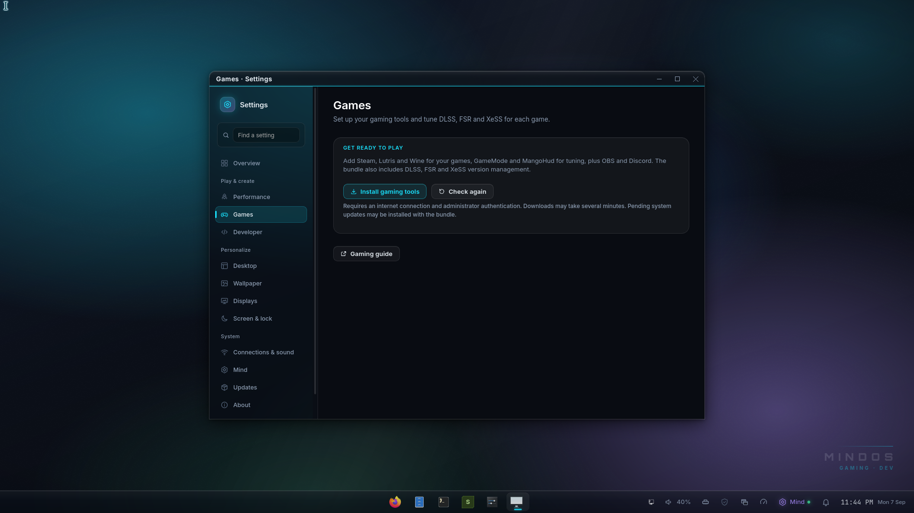
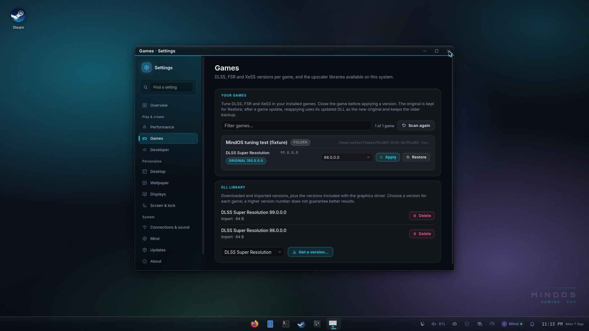

# Games: DLSS, FSR and XeSS swapping

The [gaming desktop and Game Library](GAMING-DESKTOP.md) bring installed Steam,
Heroic and Lutris games onto one shelf. Use **Tuning** on a game to open the
settings documented here. Discovery and launching use `mindos-games`; upscaler
inspection and changes continue to use `mindos-dlss`.

On a minimal installation, open **Settings › Games › Install gaming tools**.
Authenticate with your administrator password to add the `mindos-gaming`
bundle: Steam, Lutris/Wine, GameMode, MangoHud, OBS, Discord and the upscaler
tools. The install uses the MindOS and Arch repositories, needs internet,
and may apply pending system updates. The page shows when installation is
running, supports retry after a cancellation or failure, and follows the same
operation if you visit another settings page and return. When it finishes,
open Steam or Lutris from the launcher. **Gaming guide** opens this document.



Games ship particular upscaler DLL versions. A different version can change
image quality, compatibility or frame-generation behaviour; a higher version
number alone does not guarantee an improvement. `mindos-dlss` (in `mindos-gaming`) is the swapper:
Settings › Games is its face, and the Mind has it as the `dlss` tool
("put the latest DLSS in Cyberpunk").



```
mindos-dlss scan [--all]              games with an upscaler (Steam, Heroic, Lutris), their DLLs and versions
mindos-dlss library                   DLL versions on hand
mindos-dlss versions KIND             what the vendor manifests offer
mindos-dlss download KIND VERSION|latest
mindos-dlss import FILE.dll           add a DLL you have
mindos-dlss swap GAME KIND VERSION|latest
mindos-dlss restore GAME [KIND]
mindos-dlss delete KIND VERSION
mindos-dlss kinds                     the table below
```

`--json` on any of them gives the structure the Settings page reads.

| kind | DLL | what |
|---|---|---|
| `dlss` | `nvngx_dlss.dll` | DLSS Super Resolution |
| `dlss_d` | `nvngx_dlssd.dll` | DLSS Ray Reconstruction |
| `dlss_g` | `nvngx_dlssg.dll` | DLSS Frame Generation |
| `fsr_31_dx12` / `fsr_31_vk` | `amd_fidelityfx_dx12.dll` / `amd_fidelityfx_vk.dll` | FSR 3.1 |
| `xess` / `xess_fg` / `xess_dx11` / `xell` | `libxess*.dll` | XeSS, XeSS Frame Generation, XeSS DX11, XeLL |

* The version list comes from the DLSS Swapper community manifest
  (`beeradmoore/dlss-swapper-manifest-builder`), cached for a day under
  `~/.cache/mindos/dlss/`; `--refresh` fetches it again. Downloads are
  verified against the manifest's hash.
* The library lives in `~/.local/share/mindos/dlss/<kind>/<version>/`.
  The DLLs the NVIDIA driver ships in `/usr/lib/nvidia/wine/` are listed as
  source `driver` and can be swapped in without a download.
* Close the game before applying a version. A swap keeps the original next
  to the DLL as `<dll>.mindos-orig` and records its identity in `swaps.json`.
  Complete replacement files are staged on the same filesystem, then renamed
  into place; copy failures cannot leave a truncated game DLL.
* *Restore* verifies the current file and the original backup. If Steam or
  another updater changed the DLL, the page shows **Game DLL changed** and
  offers **Reapply**. Reapplying keeps that updated DLL as the new original
  and archives the older backup as `<dll>.mindos-orig.<sha256>`.
* Changes from multiple shell windows or CLI processes are serialized. Each
  DLL is recorded before replacement, so a failure between recording and
  renaming remains recoverable. A multi-DLL operation can partly complete;
  errors report how many files changed, and the page rescans even on failure.
  Damaged/missing backups or corrupt swap history stop changes with an error.
* Versions are read from the DLL's own version resource, so a file's
  version is what the game will report.

Settings › Games filters games by name or launcher and lists their DLLs, a
drop-down of unique library versions and *Apply* / *Restore*; the library card has *Get a version…*
which opens the manifest list for a kind.


The controls stay disabled during an operation and its rescan, including
keyboard activation. Failed scans show an error and a retry action instead
of claiming the library is empty. Files in symlinked subdirectories and
symlinked DLLs are excluded from discovery.
