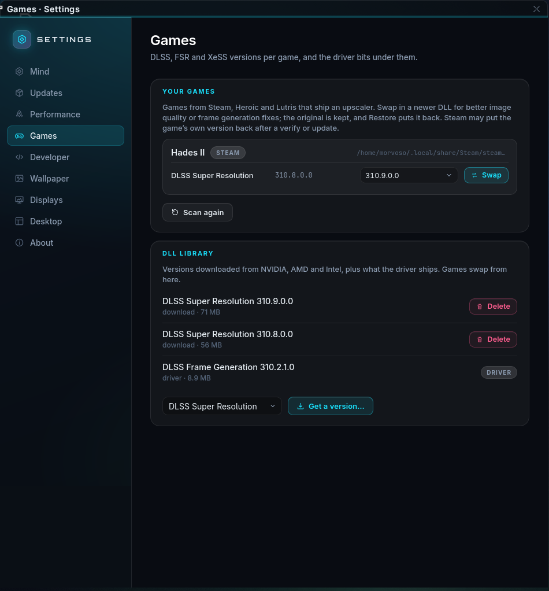

# Games: DLSS, FSR and XeSS swapping

Games ship the upscaler DLL they were tested with and rarely update it;
newer DLSS versions (and the newer transformer model) look better and fix
frame-generation issues. `mindos-dlss` (in `mindos-gaming`) is the swapper:
Settings › Games is its face, and the Mind has it as the `dlss` tool
("put the latest DLSS in Cyberpunk").



```
mindos-dlss scan [--all]              games with an upscaler (Steam, Heroic, Lutris), their DLLs and versions
mindos-dlss library                   DLL versions on hand
mindos-dlss versions KIND             what the vendor manifests offer
mindos-dlss download KIND VERSION|latest
mindos-dlss import FILE.dll           add a DLL you have
mindos-dlss swap GAME KIND VERSION|latest
mindos-dlss restore GAME [KIND]
mindos-dlss delete KIND VERSION
mindos-dlss kinds                     the table below
```

`--json` on any of them gives the structure the Settings page reads.

| kind | DLL | what |
|---|---|---|
| `dlss` | `nvngx_dlss.dll` | DLSS Super Resolution |
| `dlss_d` | `nvngx_dlssd.dll` | DLSS Ray Reconstruction |
| `dlss_g` | `nvngx_dlssg.dll` | DLSS Frame Generation |
| `fsr_31_dx12` / `fsr_31_vk` | `amd_fidelityfx_dx12.dll` / `amd_fidelityfx_vk.dll` | FSR 3.1 |
| `xess` / `xess_fg` / `xess_dx11` / `xell` | `libxess*.dll` | XeSS, XeSS Frame Generation, XeSS DX11, XeLL |

* The version list comes from the DLSS Swapper community manifest
  (`beeradmoore/dlss-swapper-manifest-builder`), cached for a day under
  `~/.cache/mindos/dlss/`; `--refresh` fetches it again. Downloads are
  verified against the manifest's hash.
* The library lives in `~/.local/share/mindos/dlss/<kind>/<version>/`.
  The DLLs the NVIDIA driver ships in `/usr/lib/nvidia/wine/` are listed as
  source `driver` and can be swapped in without a download.
* A swap keeps the original next to the new file as `<dll>.mindos-orig`
  and records it in `swaps.json`; *Restore* puts it back. Steam may restore
  the game's own file after a *Verify integrity* or a game update — the
  page shows the version that is on disk, so a re-swap is one click.
* Versions are read from the DLL's own version resource, so a file's
  version is what the game will report.

Settings › Games lists each game with its DLLs, a drop-down of the library
versions and *Swap* / *Restore*; the library card has *Get a version…*
which opens the manifest list for a kind.
