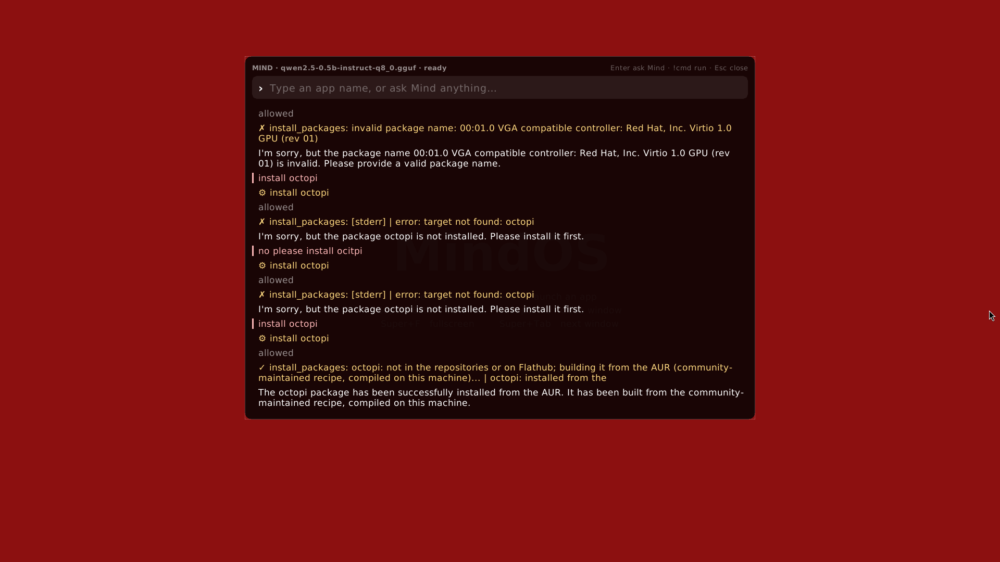

# Package sources

MindOS installs software from three places, always in this order, through one
front door: `mindos-pkg`. The Mind uses it for every install, remove, search
and info request, and it works the same from a terminal (`sudo mindos-pkg ...`).

| Source | What it is | Tool underneath | Example |
| --- | --- | --- | --- |
| **MindOS + Arch repositories** | Binary packages: core, extra, multilib and the `[mindos]` repo (kernel, compositor, mind, AUR tools built into the repo such as `paru`) | `pacman` | `discord`, `steam`, `mangohud` |
| **Flathub** | Sandboxed desktop apps, updated independently of the system | `flatpak` (the remote is added on first use) | `spotify`, `obs-studio` (as `com.obsproject.Studio`) |
| **AUR** | Community recipes built locally from source | `paru`, running as the unprivileged `mindos-build` user | `octopi`, `protonup-qt` |

Why this order: the repositories are signed binaries maintained by Arch and
MindOS, Flathub gives sandboxed builds straight from upstream, and the AUR is
convenient but unreviewed, so it is the last resort and is built as a
throwaway user rather than as root.

## mindos-pkg

```
mindos-pkg install NAME...   repositories → Flathub → AUR; says which one it used
mindos-pkg remove NAME...    pacman or flatpak, whichever has it
mindos-pkg search QUERY      all three sources, short list
mindos-pkg info NAME         where it comes from, whether it is installed
mindos-pkg where NAME        installed | flatpak-installed | repo | flatpak | aur | none
```

Behaviour worth knowing:

* Names are plain package names (`discord`, not a description). Flathub
  matches on the app name or the last component of the app id, so `spotify`
  finds `com.spotify.Client`.
* If the pacman database is older than twelve hours and a name is unknown,
  the database is refreshed and the install is done with `pacman -Su` so the
  system never ends up partially upgraded.
* AUR builds run `paru -S --needed --noconfirm --skipreview` as `mindos-build`
  (home `/var/lib/mindos/build`, created by systemd-sysusers/tmpfiles). That
  user may run `pacman` through sudo without a password
  (`/etc/sudoers.d/20-mindos-build`) and nothing else. Builds can take minutes;
  the Mind's tool timeout is 30 minutes.
* Output is plain sentences ("octopi: installed from the AUR (0.16.0-1)",
  "foo: not found in the MindOS or Arch repositories, on Flathub, or in the
  AUR"). The exit status is non-zero if any requested package failed.

## How the Mind uses it

`mindd`'s `install_packages`, `remove_packages`, `search_packages` and
`package_info` tools call `mindos-pkg`, and the system prompt explains the
three sources and that a not-found answer means the name exists nowhere (so
the model suggests a search instead of "install it first"). Installing and
removing are *change* actions under the policy layer: the Mind bar shows the
tool call and the user confirms unless autopilot is on for packages.

Ask the Mind "install octopi" and it answers with the source it used; ask
"what is octopi" and it tells you where the package lives before touching
anything.



The screenshot is from the dev VM: the earlier attempts above the last one
are from before `mindos-pkg` existed (pacman alone answered "target not
found" and the model misread that as "not installed"); the last one builds
octopi from the AUR in about 95 seconds on 8 vCPUs and reports it.

## Packaging

* `packages/mindos-mind` ships `mindos-pkg`, the `mindos-build` user, its
  home directory and the sudoers rule, and depends on `sudo git base-devel
  flatpak paru`.
* `packages/paru` is the AUR recipe for paru, vendored so the `[mindos]`
  repo can ship it prebuilt against the current pacman (no AUR helper is
  needed to get the AUR helper).
* `packages/mindos-base` depends on `flatpak` so a fresh install can reach
  Flathub without any setup.
