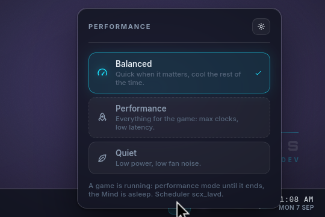
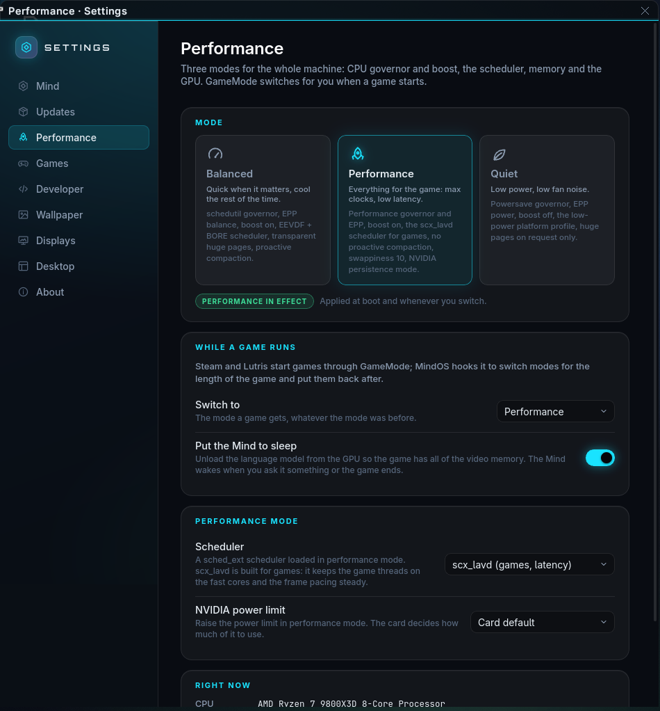

# Performance modes

MindOS has three modes for the whole machine. One command sets them,
`mindos-perf` (in `mindos-base`); the bar widget, its popup and
Settings › Performance drive that command. GameMode switches modes for the
length of a game.

| mode | CPU | scheduler | memory | GPU |
|---|---|---|---|---|
| `balanced` (default) | schedutil, EPP `balance_performance`, boost on, platform profile `balanced` | EEVDF + BORE (the kernel's) | THP `always`, proactive compaction on, swappiness 60 | — |
| `performance` | governor `performance`, EPP `performance`, boost on, platform profile `performance` | sched_ext **`scx_lavd`** (`scx-scheds`; `SCX_SCHEDULER` in the config picks another or none) | THP `always`, proactive compaction off, swappiness 10, split-lock mitigation off, autogroup off | NVIDIA persistence mode; power limit per `NVIDIA_POWER_LIMIT` (`default` / `max` / watts) |
| `quiet` | governor `powersave`, EPP `power`, boost off, platform profile `low-power` | EEVDF + BORE | THP `madvise`, proactive compaction on | persistence off |

`scx_lavd` is the sched_ext scheduler written for gaming handhelds: it
finds the latency-critical threads (the game's render and input threads)
and keeps them on the fast cores with steady frame pacing. The kernel is
built with `CONFIG_SCHED_CLASS_EXT`; the scheduler runs as a transient
`mindos-scx.service` and is stopped when the mode changes.

## Using it





```
mindos-perf status [--json]      what is in effect, and why
mindos-perf set performance      switch (persisted in /var/lib/mindos/perf/mode)
mindos-perf modes                the table above
sudo mindos-perf config NVIDIA_POWER_LIMIT max
```

Members of the `mindos` group (every desktop user) may `set`, `config`,
`apply` and run the game hooks without a password
(`/etc/sudoers.d/20-mindos-perf`). `mindos-perf.service` re-applies the
persisted mode at boot.

In the desktop: the **perf** widget on the bar shows the mode (the rocket
for performance, the leaf for quiet) and pulses while a game runs; a click
opens the picker. Settings › Performance has the same picker plus the
game settings and a table of what is in effect right now. The Mind has the
`performance_mode` tool, so "switch to quiet" in the Mind bar works too.

## While a game runs

`/etc/gamemode.ini` calls `mindos-perf game-start` / `game-end` (GameMode
is what Steam, Lutris and Heroic use to say a game is running). On the
first game:

1. the current mode is remembered (`/run/mindos/perf/prev-mode`) and
   `GAME_MODE` (default `performance`) is applied;
2. when `MIND_SLEEPS_WHILE_GAMING=1` (default) the Mind is told to sleep:
   `llama-server` stops and the whole GPU belongs to the game. Asking the
   Mind something wakes it (the chat waits for the model to load); it also
   wakes when the last game ends.

`mindos-perf set` during a game only records the wish: the new mode takes
over when the game ends. `mindos-perf status` says so.

GameMode raises the CPU governor and a few `/proc/sys` values through its own
helpers, which ask polkit first; its packaged rules only allow the `gamemode`
group, so `mindos-gaming` ships
`/usr/share/polkit-1/rules.d/50-mindos-gamemode.rules` allowing every
`com.feralinteractive.GameMode.*` action for local, active members of the
`mindos` group. Without it the helpers fail with "Not authorized" and a game
would stop to ask for a password. `mindos-perf` itself is not on polkit at
all: the hooks and the boot-time `apply` have to run with nobody watching, so
it stays on the sudoers file (`20-mindos-perf`, group `mindos`, `NOPASSWD`).
The password dialog the desktop shows for everything else is in
[SHELL.md](SHELL.md#the-authentication-dialog-polkit).

## Config: `/etc/mindos/perf.conf`

```
GAME_MODE=performance            # balanced | performance | quiet | "" (leave alone)
MIND_SLEEPS_WHILE_GAMING=1
SCX_SCHEDULER=scx_lavd           # any scx_* from scx-scheds, or "" for EEVDF+BORE
SCX_ARGS=""
NVIDIA_POWER_LIMIT=default       # default | max | <watts>
```

`mindos-perf config KEY VALUE` edits it with validation; Settings ›
Performance uses that. A changed power limit applies at once when
performance mode is in effect; the other keys at the next mode switch.

## What it does not do

No undervolting, no fan curves and no per-core pinning: those are
hardware-specific and the wrong defaults do damage. The modes only use the
knobs the kernel and the driver expose for exactly this.
