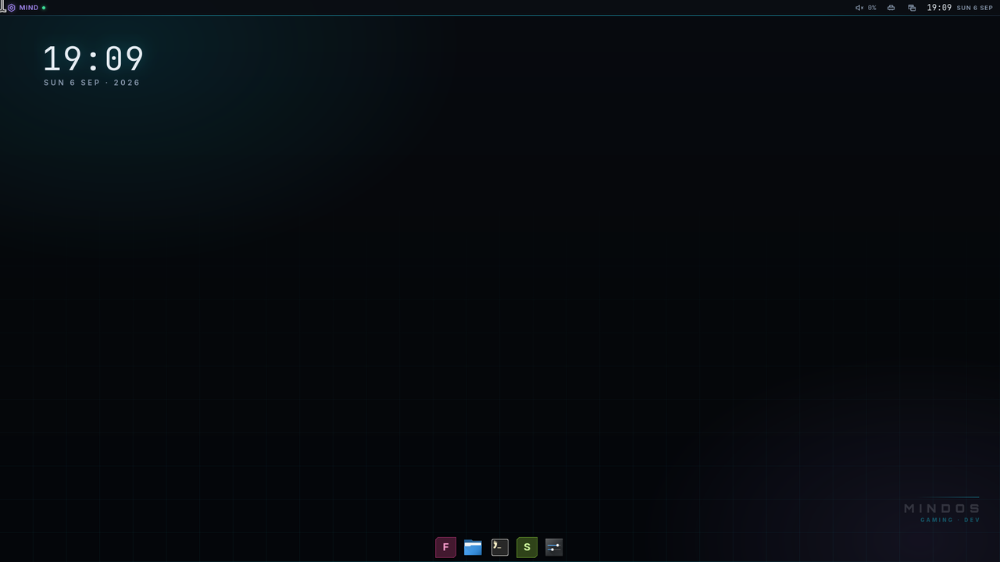
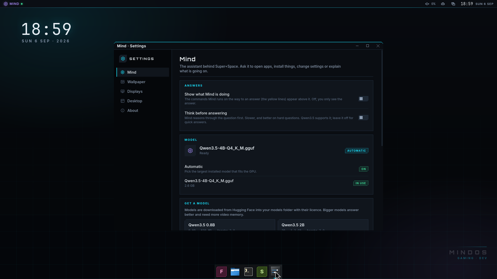
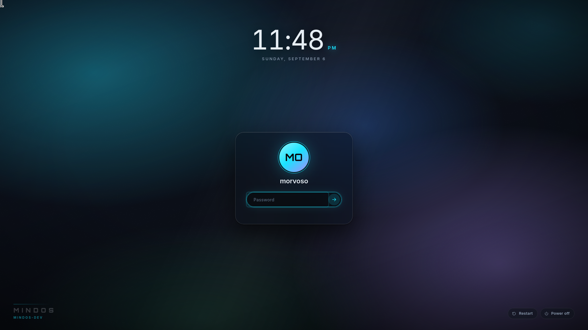

# mindshell — the MindOS desktop shell

`mindshell` is the MindOS desktop environment: the dock, the top bar
(system tray, clock, layout switcher), desktop widgets, the Settings app and
the login screen. It is one small Rust process (the *host*) that opens layer-shell
windows on the compositor and renders every window with WebKitGTK; the user
interface itself is HTML/CSS/TypeScript (`mindshell/ui`). The host owns
everything that needs the system (D-Bus, the compositor IPC, files,
processes); the UI owns everything visual and is hot-reloadable. There is no
launcher button: a tap on Super opens the compositor's Mind bar, which
launches programs, runs commands and talks to the Mind.

```
mindwm ──(layer-shell + IPC socket)── mindshell host ──(bridge)── WebKit UI
                                          │
                                          ├── StatusNotifier (tray) on D-Bus
                                          ├── desktop entries + icon themes
                                          ├── wpctl / nmcli / sysfs / procfs
                                          └── ~/.config/mindos/shell/layout.json
```



Design rules: minimal, dark, futuristic. One accent (electric cyan). Red is
reserved for the kernel/boot stages and never appears in the shell. No blur,
no animations that cost GPU time while a game runs. Everything is a *widget*
in a *container* (panel or desktop); the layout is data (`layout.json`) and
the whole desktop is rebuilt from it, so *edit mode* is just editing that
data with a nicer UI.

## Processes and files

| What | Where |
|---|---|
| host binary | `/usr/bin/mindshell` |
| UI bundle (built by esbuild) | `/usr/share/mindos/shell/ui/` (`index.html`, `app.js`, `app.css`, `fonts/`) |
| default layout | `/usr/share/mindos/shell/layout.json` |
| user layout | `~/.config/mindos/shell/layout.json` |
| host config | `/etc/mindos/shell.toml`, `~/.config/mindos/shell.toml` |
| user service | `mindos-shell.service` (systemd --user, `Restart=on-failure`), started by `/etc/xdg/mindos/autostart/50-mindshell` |
| log | `journalctl --user -u mindos-shell` |
| app windows | `mindshell --app settings [--page mind\|wallpaper\|displays\|shell\|about]`: an ordinary toplevel (app id `mindos-settings`) with the compositor's title bar; desktop entries `mindos-settings`, `mindos-displays`, `mindos-wallpaper`. Files is Nautilus (`mindos-apps`), not a shell window |

Environment: `WAYLAND_DISPLAY` (from the compositor), `MINDWM_SOCKET` (the
compositor IPC socket, exported by mindwm to everything it spawns and imported
into `systemd --user` by `session-startup`), `MINDSHELL_UI_DIR` (override the
UI bundle location, for development), `MINDSHELL_DEVTOOLS=1` (enable the
WebKit inspector, `mindshell --devtools` does the same).

`shell.toml`:

```toml
[shell]
icon_theme = "breeze-dark"      # any installed XDG icon theme; hicolor is the fallback
hardware_acceleration = "always" # always | never (WebKit compositing policy)
terminal = "foot"
icon_size = 48                   # dock / taskbar icon size in logical pixels
```

## Layout (`layout.json`)

The default (`mindshell/data/layout.json`): one 48 px bar flush with the
bottom edge, Windows-style — the task bar centred on the screen; the tray,
status widgets, Mind and the clock at the right; the Desktop folder as icons
on the wallpaper and no desktop widgets. It is only a default: edit mode
moves panels to any edge, adds a dock (a fit-to-content panel) or a top bar,
adds widgets and re-orders them.

```json
{
  "version": 1,
  "panels": [
    {
      "id": "bar",
      "output": "*",
      "edge": "bottom",
      "size": 48,
      "length": 100,
      "align": "center",
      "margin": 0,
      "layer": "top",
      "opacity": 0.85,
      "float": false,
      "autohide": false,
      "widgets": [
        { "id": "sp-l", "type": "spacer", "config": { "expand": true } },
        { "id": "tasks", "type": "taskbar", "config": { "pins": ["firefox.desktop", "org.gnome.Nautilus.desktop", "foot.desktop", "steam.desktop", "mindos-settings.desktop"] } },
        { "id": "sp-r", "type": "spacer", "config": { "expand": true } },
        { "id": "tray", "type": "tray", "config": {} },
        { "id": "audio", "type": "audio", "config": {} },
        { "id": "net", "type": "network", "config": {} },
        { "id": "bat", "type": "battery", "config": {} },
        { "id": "mode", "type": "layout-mode", "config": {} },
        { "id": "mind", "type": "mind", "config": {} },
        { "id": "clock", "type": "clock", "config": { "seconds": false, "date": true, "hour24": false } }
      ]
    }
  ],
  "desktop": {
    "wallpaper": { "mode": "builtin" },
    "icons": true,
    "widgets": []
  }
}
```

* `panel.output`: `"*"` means one instance of the panel on every output;
  otherwise a connector name (`DP-1`, `Virtual-1`).
* `edge`: `top | bottom | left | right`. `size` is the thickness in logical
  pixels (also the exclusive zone). `length` is a percentage of the edge
  (100 = full width); `0` means *fit to content*: the panel is as long as its
  widgets and grows and shrinks with them (the dock). `align`:
  `start | center | end` when `length < 100`. `layer`: `top` (normal) or
  `bottom` (windows cover it, like a dock that hides under maximized
  windows). `margin`: distance from the edge. `opacity` is the panel
  background's alpha (`0` = the widgets float on the wallpaper, macOS-style);
  `autohide` slides the panel away until the pointer touches its edge.
  `float`: `true` draws the bar as a rounded island inset from the edge,
  `false` flush with the edge (one hairline on the inner side); when unset a
  panel thicker than 30 px floats and a thinner one is flush (`--inset` and
  `--r-island` in `app.css`).
* Widgets are ordered left→right (or top→bottom on vertical panels). A
  `spacer` with `expand: true` pushes what follows to the far end. With two
  expanding spacers the widgets between them are centred on the bar itself
  (the Windows way: a wide tray does not push the apps off centre); if the
  sides leave no room the spacers fall back to sharing the space equally.
* Desktop widgets have a position/size in logical pixels on their output.
* `desktop.icons` (default `true`) shows the Desktop folder (`fs.desktop`:
  the XDG desktop directory, `~/Desktop` otherwise, created if missing) as
  icons on the wallpaper, column by column from the top left, clear of the
  panels. Click selects (Ctrl adds), double-click opens (`.desktop` files
  show as and launch their application, folders open in the file manager),
  right-click offers open / show in Files / move to trash; the desktop's own menu toggles
  the icons. The host watches the folder and broadcasts `desktop.changed`.
* Unknown widget types render as an "unavailable" placeholder and are kept.

### Widget types (v1)

| type | container | what |
|---|---|---|
| `taskbar` | panel | pinned apps + running windows (the dock); click focuses (a second click minimises in floating mode; tiles are never minimised, the columns strip slides to the window instead), middle-click new instance, right-click pin/unpin/close. Windows programs (a window with `wine: true`, or an entry with `wine: true`) show a small four-pane badge on the icon's corner and say so in the tooltip; the entry is matched to its windows through `wmClass` first. Settings: `pins` (desktop ids), `showRunning` (off = a launcher of pinned apps only), `onlyThisOutput`, `labels`, `maxLabel`, `indicator` |
| `spacer` | panel | flexible or fixed gap (`expand`, `size`) |
| `clock` | panel | time (+ date); click opens the calendar popup. Settings: `hour24` (default false: 12-hour with AM/PM), `suffix`, `leadingZero`, `seconds`, `date`, `dateFormat` (`short` Sun 6 Sep / `long` / `numeric` / `iso` / `weekday`), `stack` (date under the time), `size` (`small`/`normal`/`large`), `weekStart` (`monday`/`sunday`, for the calendar) |
| `layout-mode` | panel | the compositor's window layout (floating / tiles / columns) as an icon; click opens the layout picker popup. Setting: `label` |
| `tray` | panel | StatusNotifierItems plus the compositor's XEmbed icons (Wine, older X11 programs; `xembed: true`, ids `x11:<window>`, no menu of their own: right-click is replayed as a right-click); left-click activate, right-click menu, scroll. Settings: `hidePassive`, `iconSize` |
| `audio` | panel | default sink volume; scroll adjusts, click opens the slider popup, middle-click mutes. Settings: `percent`, `scroll`, `step`, `hideWhenMuted` |
| `network` | panel | wired/wifi state. Settings: `name`, `ip` |
| `battery` | panel | charge state (hidden when no battery). Settings: `percent`, `warnAt`, `alwaysShow` |
| `mind` | panel | Mind (mindd) status; click toggles the Mind bar. Settings: `label`, `model` |
| `sysmon` | panel | compact CPU / memory / GPU bars. Settings: `cpu`, `memory`, `gpu`, `interval` |
| `power` | panel | power menu button. Setting: `label` |
| `desktop-clock` | desktop | large clock + date. Settings: the clock's time/date ones plus `year`, `size` (px), `align`, `glow` |
| `desktop-sysmon` | desktop | CPU / memory / GPU graphs. Settings: `title`, `cpu`, `gpu`, `memory`, `interval`, `history` (samples), `fill` |
| `desktop-notes` | desktop | a sticky note (plain text, stored in the widget config). Settings: `title`, `fontSize`, `mono` |

Every widget's settings are reachable without edit mode: right-click the
widget (a panel widget or a desktop one) and pick *… settings*; the same
menu offers *Edit the panel* / *Edit desktop*, *Add widget* and *Remove*.
Changes apply and save as they are made; *Defaults* clears the widget's
config. In edit mode the gear button on each widget opens the same form.

Adding a widget type = one TypeScript module registering `{ type, name,
description, containers, defaults, settings?, create(ctx) }` in the widget
registry.

## Windows the host creates

One WebKit view per window; all views share one web process (`related-view`)
and one `mindos://shell/` origin.

| kind | layer-shell | where |
|---|---|---|
| `desktop` (one per output) | `background`, anchored to all edges, exclusive −1, keyboard `none` (`on-demand` while in edit mode) | wallpaper, desktop icons, desktop widgets, edit-mode toolbar, right-click menu |
| `panel` (one per panel × output) | `top`/`bottom` per layout, anchored to the panel edge (+ both sides when `length` = 100), exclusive zone = `size` + `margin`, keyboard `none` | the panel and its widgets; in edit mode the window is enlarged by 140 px toward the screen centre (exclusive zone unchanged) to show the panel settings strip |
| `popup` (transient) | `overlay`, anchored to all edges (full output, transparent), keyboard `exclusive` when `keyboard: true` else `on-demand` (the compositor hands an on-demand popup the keyboard as soon as it maps) | calendar, layout picker, audio slider, power menu, tray menus, widget catalog, widget settings, context menus. Clicking the transparent area or pressing Escape closes it |
| `app` (`mindshell --app <name>`) | a normal xdg toplevel, no client decorations (the compositor draws the title bar), app id `mindos-<name>` | the Settings app; one process per window, `app.close` ends it |
| `greeter` (`mindshell --app greeter`, one per output) | `overlay`, anchored to all edges, exclusive −1, keyboard `exclusive` on the first output and `none` on the others | the login screen: wallpaper and clock everywhere, the login card, the other accounts, the session and the power buttons on the first output. Started by greetd through `mindos-greeter` (see *The login screen* below) |

Every window loads `mindos://shell/app/index.html?kind=<kind>&id=<id>&output=<name>`
(`&popup=<name>&arg=<json>` for popups). `?kind=preview` renders every
window stacked on one page: it is what `make shell-preview` screenshots in
Chromium for design work without a compositor.

## The bridge (`window.mindos`)

Injected into every view before any script runs.

```ts
mindos.call(method: string, params?: object): Promise<any>   // request → host
mindos.on(event: string, cb: (payload: any) => void): () => void
mindos.window: { kind, id, output, popup?, arg? }            // parsed from the URL
```

Transport: `window.webkit.messageHandlers.mindos.postMessage(JSON.stringify({id, method, params}))`;
the host answers with `window.mindos._reply(id, ok, payload)` and pushes
events with `window.mindos._dispatch(event, payload)`. When the page is not
inside the host (a browser), `src/mock.ts` installs a fake host with sample
data so the UI can be developed in Chromium/Firefox.

### Methods

| method | params → result |
|---|---|
| `shell.state` | → `{ user, host, uptime, outputs, windows, focused, apps, tray, layout, editMode, config }` |
| `shell.ready` | the view has rendered its first frame |
| `shell.setEditMode` | `{ enabled }` → broadcasts `edit_mode` |
| `shell.exec` | `{ cmd }` runs a command line in the session (`sh -c`) |
| `shell.reload` | reloads every view (development) |
| `layout.get` | → `layout` |
| `layout.save` | `{ layout }` → validates, writes the user file, rebuilds windows, broadcasts `layout` |
| `layout.reset` | back to the default layout |
| `popup.open` | `{ name, keyboard?, anchor?: {x,y,w,h,edge}, arg? }` → opens (or moves) the popup on the calling window's output |
| `popup.close` | `{ name }` (or none = the calling popup) |
| `popup.toggle` | as `open`, but closes when already open |
| `windows.focus` | `{ id }` (unminimises) |
| `windows.close` | `{ id }` |
| `windows.minimize` | `{ id }` |
| `windows.toggleMinimize` | `{ id }` |
| `apps.list` | → `[{ id, name, comment, exec, icon, categories, terminal, wmClass, wine }]` (`icon` is a `mindos://shell/icon/...` URL; `wmClass` is the entry's `StartupWMClass`; `wine` marks an entry whose Exec runs `wine`/`proton`, such as the ones Wine's menu builder writes under `applications/wine/`) |
| `apps.launch` | `{ id }` or `{ exec, terminal }` |
| `tray.items` | → `[{ id, title, tooltip, icon, status, hasMenu }]` |
| `tray.activate` / `tray.secondaryActivate` | `{ id, x, y }` |
| `tray.scroll` | `{ id, delta, orientation }` |
| `tray.menu` | `{ id }` → `[{ id, label, enabled, type: "item" \| "separator" \| "submenu", toggle?: "checkmark" \| "radio", checked?, icon?, children? }]` |
| `tray.menuClick` | `{ id, item }` |
| `mind.toggle` | opens/closes the compositor's Mind bar |
| `mind.status` | → `{ connected, ready, model }` |
| `mind.request` | `{ request }` (a `{ type, ... }` object for mindd: `models`, `set_model`, `set_thinking`, `download_model`, `cancel_download`, `status`) → the first event the daemon answers with (the Settings page polls `models` while a download runs) |
| `panel.fit` | `{ length }` (content length in logical pixels) from a `length: 0` panel: the host resizes the panel window and answers `{ length }` |
| `wm.layoutMode` | → `{ mode, label, modes: [{ mode, label, description }] }` |
| `wm.setLayoutMode` / `wm.cycleLayoutMode` | `{ mode }` / none → the new `{ mode, label }`; also broadcast as `layout_mode` |
| `wm.outputs` | → `{ outputs }` with the compositor's full output records (modes, position, transform, VRR, primary) |
| `wm.setOutput` | `{ name, width?, height?, refresh? (mHz), scale?, position?: [x, y], transform?, enabled?, vrr?, primary? }` → applied and persisted by the compositor |
| `prefs.get` / `prefs.set` | none / `{ prefs }` → `{ prefs }` (compositor preferences: `layout_mode`, `mind_show_tools`, `primary_output`, `outputs`); `prefs` is broadcast on every change |
| `wallpaper.list` | → `[{ path, name, folder }]`: the images in `/usr/share/mindos/wallpapers`, `~/.local/share/mindos/wallpapers` and `Wallpapers/` under the pictures folder (images are shown through `mindos://shell/thumb/`) |
| `fs.desktop` | → `{ path }` the Desktop folder shown as icons |
| `fs.list` | `{ path, hidden? }` → `{ path, parent, entries: [{ name, path, dir, size, mtime, hidden, symlink, mime, icon, image }] }` |
| `fs.trash` | `{ paths }` → `{ count }` (through GIO, so it lands in the freedesktop trash) |
| `fs.open` | `{ path }` → opens with the default application for the file's MIME type (GIO; a folder opens in the file manager, `Terminal=true` entries get the configured terminal) |
| `shell.openApp` | `{ name: "settings", page?, arg? }` → spawns `mindshell --app` |
| `app.close` / `app.setTitle` | none / `{ title }` (app windows only) |
| `system.power` | `{ action: "shutdown" \| "reboot" \| "suspend" \| "logout" }` |
| `greeter.info` | → `{ users: [{ name, display, avatar? }], sessions: [{ id, name, exec }], last: { user?, session? }, host }` (login screen only; accounts with a login shell and a uid from 1000, `/usr/share/wayland-sessions`, `/var/lib/AccountsService/icons`) |
| `greeter.login` | `{ user, password, session }` → `{ status: "started" }` \| `{ status: "prompt", secret, message, notes }` \| `{ status: "failed", message, notes }` (the greetd conversation; a `prompt` is answered with `greeter.respond { response, session }`, dropped with `greeter.cancel`) |
| `greeter.done` | after `started`: asks the compositor to quit so greetd starts the session |
| `greeter.power` | `{ action: "poweroff" \| "reboot" \| "suspend" }` |
| `system.stats` | → `{ cpu, memUsed, memTotal, gpu?: { util, temp, mem, memTotal, name }, load, uptime }` |
| `audio.get` | → `{ volume, muted, sink }` |
| `audio.set` | `{ volume }` (0..1.5) |
| `audio.toggleMute` | |
| `network.status` | → `{ connected, kind: "ethernet" \| "wifi" \| "none", ssid?, iface, ip? }` |
| `battery.status` | → `{ present, percent, charging, timeToEmpty? }` |
| `icons.resolve` | `{ name, size }` → URL |

### Events

| event | payload |
|---|---|
| `windows` | `{ windows: [...], focused }` (full snapshot on every change) |
| `outputs` | `{ outputs: [...] }` |
| `apps` | `{ apps }` (desktop database changed) |
| `tray` | `{ items }` |
| `layout` | `{ layout }` |
| `edit_mode` | `{ enabled }` |
| `popup_state` | `{ name, open, output }` |
| `mind` | `{ connected, ready, model }` |
| `audio` | `{ volume, muted }` |
| `shortcut` | `{ name }` forwarded from the compositor (`overview`) |
| `layout_mode` | `{ mode, label, modes? }` whenever the compositor's window layout changes |
| `prefs` | `{ prefs }` whenever a compositor preference changes |
| `desktop.changed` | `{ path }` when something in the Desktop folder changed (debounced) |

`mindos://shell/icon/<name>?size=N` serves an icon from the configured theme
(`hicolor` fallback, SVG or PNG); an absolute path in place of `<name>` serves
that file. `mindos://shell/tray/<id>` serves a tray item's pixmap.
`mindos://shell/file/<absolute path>` serves a file from disk (wallpapers,
image previews) and `mindos://shell/thumb/<absolute path>?size=N` a scaled
thumbnail of an image.
`mindos://shell/app/...` serves the UI bundle; `mindos://shell/app/fonts/...`
serves the bundle's own `fonts/` first and falls back to
`/usr/share/fonts/mindos` and the system font directories.

### Host implementation notes

What `mindshell` (the Rust host in `mindshell/`) does beyond the tables above:

* **Panel `output`.** `*` = every output, a connector name = that output, and
  `primary` (or an empty string) = the first output (top-left in GDK's
  monitor list, which is also `outputs[0]` in `shell.state`).
* **Popup anchors pass through.** `popup.open` / `popup.toggle` take the
  `anchor` in output-local logical pixels, as the UI conventions below say
  (the UI adds the panel window's origin itself); the host does not translate
  it. The popup receives it as `mindos.window.anchor` (the `&anchor=<json>`
  URL parameter) and inside `mindos.window.arg.anchor`, and places itself.
* **Popups.** One window per popup name across all outputs; opening the same
  name from another output moves it (a `popup_state` close for the old
  output, then an open). Re-opening an already open popup on the same output
  re-navigates the view only when its URL (arg/anchor) changed. `popup.toggle`
  replies `{ name, open, output }`. Escape closes a popup at the host level
  (a GTK key controller in the capture phase); clicking the transparent area
  is the UI's `popup.close`. A closed window is unmapped at once but its view
  lives on, hidden, for 1.5 s: a menu that calls `popup.close` and then runs
  its action (`shell.setEditMode`, `popup.open`, `shell.exec`, ...) still gets
  that request answered.
* **`shortcut` events are forwarded only.** The host broadcasts the
  compositor's `shortcut` to every view and opens nothing itself. The
  compositor keeps the Super tap for its own Mind bar (there is no launcher
  popup) and only forwards `overview`.
* **Extra methods.** `windows.unminimize`, `windows.toggleFullscreen`,
  `windows.toggleMaximize`, `mind.open`, `mind.close`, `outputs.list`.
  `shell.exec` also accepts `terminal: true`.
* **Extra fields.** `shell.state` adds `compositor` (IPC connected),
  `devtools`, `config.icon_size`; `mind` adds `open` (the Mind bar state) and
  merges whatever the compositor answers to a `mind_status` request or sends
  as a `mind_status` / `mind` event; `audio` adds `available` (false when
  `wpctl` is missing); each app carries `iconName` next to the resolved
  `icon` URL; tray items carry `isMenu` and `app` (the item's D-Bus id);
  `system.stats` gives `load` as `[1m, 5m, 15m]`, `cores`, and `gpu` from
  `nvidia-smi` sampled every 2 s on a thread (null without a GPU).
* **Launching.** `apps.launch` and `shell.exec` go through the compositor's
  `launch` request when the IPC is connected (so the program gets the
  session's environment); otherwise the host runs `sh -c` itself, detached in
  a new session, using `terminal` from `shell.toml` for terminal entries.
* **Icons.** `icons.resolve` answers `null` when nothing matches; `apps.list`
  falls back to `application-x-executable`. The theme is picked at startup
  (the configured one, then breeze-dark, breeze, Papirus-Dark, Papirus,
  Adwaita, hicolor) by looking for `<dir>/<theme>/index.theme`. Tray items
  prefer a themed icon name (also via the item's `IconThemePath`) and fall
  back to their pixmap, served as PNG from `mindos://shell/tray/<id>?v=N`.
* **Unknown compositor events** are broadcast to the views under their own
  name, so the compositor can grow events without a host change.
* **Edit mode** re-fits desktop and panel windows in place (`edit_mode` is
  broadcast after the geometry changed); the panel window grows by 140 px
  toward the centre, the exclusive zone stays `size + margin`.
* **Robustness.** Bad bridge JSON is logged and dropped; a crashed web
  process reloads its view after 500 ms; monitors appearing or disappearing
  re-create the windows (debounced 300 ms so the connector name has arrived);
  the compositor socket is retried with backoff and every state that came
  from it is cleared on disconnect. `GDK_BACKEND=wayland` is forced and the
  host exits with status 1 when the compositor has no layer-shell.
* **Service.** `mindos-shell.service` uses `KillMode=mixed` so only the host
  gets SIGTERM (WebKit's helper processes follow it), `Restart=on-failure`
  with a 5-per-minute limit. `50-mindshell` imports `WAYLAND_DISPLAY`,
  `DISPLAY` and `MINDWM_SOCKET` into `systemd --user` and restarts the unit;
  without a user manager it runs `mindshell` detached.

## The compositor IPC (mindwm)

mindwm listens on `$XDG_RUNTIME_DIR/mindwm-<wayland-socket>.sock` and exports
the path as `MINDWM_SOCKET` to the programs it starts. Newline-delimited JSON;
each request may carry an `id` that the reply echoes.

Requests → replies (`{"id":1,"ok":true,"result":{...}}` or `{"id":1,"ok":false,"error":"..."}`):

| type | fields | result |
|---|---|---|
| `subscribe` | | `{}` then a `windows`, an `outputs` and a `mindbar` event immediately, and every change afterwards |
| `get_windows` | | `{ windows, focused }` (same shape as the `windows` event) |
| `get_outputs` | | `{ outputs }` |
| `focus` | `window` | raise, unminimise and focus |
| `close` | `window` | |
| `minimize` / `unminimize` / `toggle_minimize` | `window` | |
| `toggle_fullscreen` / `toggle_maximize` | `window` | |
| `mindbar` | `action: toggle \| open \| close` | |
| `overview` | `action: toggle` | |
| `launch` | `exec`, `terminal?` | spawn in the session |
| `terminal` | | open the configured terminal |
| `quit` | | end the session |
| `get_layout_mode` | | `{ mode, label, modes: [{ mode, label, description }] }` |
| `set_layout_mode` / `cycle_layout_mode` | `mode` / | the new `{ mode, label }`; every window is re-arranged and the choice is persisted |
| `get_prefs` / `set_prefs` | / `prefs` (partial) | `{ prefs }`: `layout_mode`, `mind_show_tools` (show the Mind's tool lines), `primary_output`, `outputs: { name: { enabled, mode: "WxH@mHz", scale, position, transform, vrr } }`, stored in `$XDG_STATE_HOME/mindos/mindwm.json` |
| `tray_click` | `icon` (the `id` from the `tray` event), `button` (1 left, 2 middle, 3 right, 4/5 wheel up/down, 6/7 wheel left/right) | replays the click on the XEmbed icon at the pointer's position, so the program's own menu opens under the cursor |
| `set_output` | `name`, then any of `width` + `height` + `refresh` (mHz), `scale`, `position: [x, y]`, `transform`, `enabled`, `vrr`, `primary` | applies the mode/scale/position/rotation/VRR/primary change, persists it and sends an `outputs` event |

Events (`{"event":"...", ...}`):

| event | fields |
|---|---|
| `windows` | `windows: [{ id, title, app_id, focused, fullscreen, maximized, minimized, x11, wine, output }]`, `focused: id \| null`. `wine` is true when the window's process runs under Wine or Proton (a Windows program), judged from `/proc/<pid>/exe` and `WINELOADER` in its environment |
| `outputs` | `outputs: [{ name, make, model, x, y, width, height, scale, refresh, transform, modes: [{ width, height, refresh (mHz), preferred, current }], enabled, vrr, vrr_supported, primary, mm_width, mm_height }]` (logical pixels; `refresh` in Hz, e.g. `240.0`) |
| `shortcut` | `name`: `overview` (`Super+W`). Only sent while someone is subscribed; without a shell the compositor opens its own window preview instead. A tap on Super alone always opens the compositor's Mind bar |
| `mindbar` | `open: bool` |
| `layout_mode` | `mode`, `label`, `modes` (after `subscribe` and on every change) |
| `prefs` | `prefs` (after `subscribe` and on every change) |
| `tray` | `items: [{ id, title, class, pid, width, height, pixels }]`: the XEmbed (legacy X11) tray icons the compositor hosts, `pixels` base64 RGBA with straight alpha, `width`/`height` 24. Sent after `subscribe` and whenever an icon docks, undocks, renames or redraws (icons are read back every 400 ms) |

Window ids are stable for the life of a window and follow creation order.
Snapshots are sent whenever any listed field changes (map, unmap, title,
focus, state); override-redirect X11 windows (menus, tooltips) and toplevels
that have not drawn yet are not listed. Errors look like
`{"id":1,"ok":false,"error":"no such window: 9"}`; a request line over 64 KiB
or 4 MiB of unread events disconnects the client.

## Development

```sh
# UI only, in a browser with the mock host
cd mindshell/ui && npm install && npm run dev        # esbuild --watch → dist/
chromium dist/index.html?kind=preview

# host + UI in the dev VM (docs/DEV-VM.md)
make packages && make repo
scripts/vm/vdrive.py exec 'pacman -Syu --noconfirm && systemctl --user -M morvoso@ restart mindos-shell'
scripts/vm/vdrive.py shot shot.png
```

## UI conventions (mindshell/ui)

What the TypeScript side assumes beyond the tables above. The host has to
match these; everything else is internal to the bundle.

**Build.** `npm run build` writes `dist/` (`index.html`, `app.js`, `app.css`,
`fonts/*.ttf`); the host serves that directory as `mindos://shell/app/`.
`npm run check` type-checks, `npm run dev` rebuilds on change, `npm run shot`
renders the preview page with headless Chromium into `shots/`
(`CHROMIUM=/path/to/chrome` to override the binary). No runtime dependencies;
esbuild and TypeScript are dev-only.

**Bridge fallback.** If `window.mindos` is missing `call`/`on` at load time
the UI builds them itself on top of
`window.webkit.messageHandlers.mindos`, so the host only has to inject the
message handler and call `window.mindos._reply(id, ok, payload)` /
`window.mindos._dispatch(event, payload)`. `shell.ready` carries
`{ kind, id, popup }`. Methods that fail reject with the host's error string.

**Anchors.** `popup.open`/`popup.toggle` receive the anchor twice: as the
top-level `anchor` (for the host) and inside `arg.anchor` (for the popup
page). Coordinates are output-local logical pixels. The popup places itself
8 px away from the anchor on the side opposite `anchor.edge` (a `bottom`
panel opens upwards, `top` downwards, `left`/`right` sideways), centred on
narrow anchors; without an `edge` the anchor is treated as a pointer position
(context menus). A missing anchor centres the popup on the output.

**Panel geometry.** For anchors and the preview the UI computes each panel
window as: thickness `size` (+140 px in edit mode), `margin` from its edge,
length `length`% of the edge placed by `align` (`start` = left/top corner,
`end` = right/bottom, `center`). Vertical panels are inset by the exclusive
zones (`size + margin`) of the horizontal panels on the same output, so the
host must create top/bottom panel surfaces before left/right ones. A
`length` < 100 panel should be anchored to its edge plus the `align` side
(or the edge only for `center`) with the window sized to `length`% of the
output.

**Popups and their `arg`.**

| name | arg |
|---|---|
| `calendar` | `{ hour24?, suffix?, weekStart? }` (the clock passes its own settings) |
| `layout-mode` | none (lists the compositor's modes, the current one marked) |
| `audio` | none |
| `power` | none |
| `context-menu` | `{ title?, items: [{ label, icon?, disabled?, separator?, danger?, action? }] }` |
| `tray-menu` | `{ id, title? }` (calls `tray.menu` itself) |
| `widget-catalog` | `{ target: { kind: "panel", id } \| { kind: "desktop", output } }` |
| `widget-settings` | `{ target: { kind: "panel", id, widget } \| { kind: "desktop", widget } }` |

An `action` is one of `{ call, params }`, `{ popup, arg?, keyboard? }`,
`{ editMode }`, `{ exec }`, `{ pin: { panel, widget, app, pinned } }`,
`{ desktopIcons }` or `{ removeWidget: { kind, panel?, widget } }`; menus
run it through the host so a popup window can act on another window's
behalf.

**`shortcut` events.** The host forwards them to every view and opens
nothing itself; only `overview` arrives today. `layout.reset` is expected to
broadcast a `layout` event like `layout.save` does.

**Fit panels.** A panel with `length: 0` measures its widgets after every
render and calls `panel.fit` with the content length; the host resizes the
window (keeping `align`) and the panel background is drawn by the UI, so
`opacity: 0` gives free-floating icons.



**App windows.** `?kind=app&app=<name>&page=<page>&arg=<json>` renders the
Settings (`settings`) app in an ordinary window. Apps use
the same widgets, theme and bridge as the panels; `app.setTitle` updates the
compositor's title bar and `app.close` ends the process. Settings pages:
`mind` (tool lines, thinking, model catalog and downloads through
`mind.request`), `wallpaper` (`wallpaper.list`, the layout's
`desktop.wallpaper`), `displays` (basic: resolution / refresh rate / scale
per output; advanced: position, rotation, VRR, primary, enable, through
`wm.outputs` / `wm.setOutput`), `shell` (layout mode, panels, edit mode),
`about`.

## The login screen



`mindshell --app greeter` is the greeter for [greetd](https://sr.ht/~kennylevinsen/greetd/),
the login manager MindOS uses (Arch `greetd`, nothing from the AUR). greetd
runs `mindos-greeter` (`mindos-session`) on VT 1 as the unprivileged
`greeter` user: it is `mindwm --tty-udev` with
`/etc/mindos/greeter/mindwm.toml` on top of the normal configuration
(`[session] kiosk = true`: no Mind bar, no launcher, no shortcut or IPC
request that starts a program; `[startup].exec = ["mindshell --app greeter"]`),
so the login screen is the same compositor and the same UI stack as the
desktop, in the same theme. greetd does the authenticating (PAM, through
`/etc/pam.d/greetd`); the greeter only relays the conversation over
`$GREETD_SOCK`: `create_session` → the password at the first secret prompt →
any further prompt (a one-time code, an expired password) shown as is and
answered through `greeter.respond` → `start_session` with the chosen
session's `Exec` → `greeter.done` ends the greeter compositor and greetd
starts the session as the user. The greeter keeps nothing but
`/var/lib/mindos/greeter/state.json` (who signed in last, which session;
systemd-tmpfiles creates the directory). WebKit runs an ephemeral session
there, the process can open no links, and the host refuses every bridge
method except `greeter.*` and `shell.state` / `shell.ready`.

The page: the aurora wallpaper and a clock on every output; on the first
output a frosted card (real `backdrop-filter`, this window has the wallpaper
in its own DOM) with the account's avatar (AccountsService icon or initials),
the password field (Enter submits; a wrong password shakes the card and
clears the field; Caps Lock is announced), the other accounts as chips when
there are any, the session as a pill when more than one is installed, the
wordmark with the host name, and Restart / Power off buttons that ask for a
second click. A successful login says "Welcome" and fades out before the
hand-over. The installer offers to skip the login screen (`initial_session`
autologin, once per boot); logging out always shows it.

**Wallpaper.** With `desktop.wallpaper.mode = "image"` the desktop sets
`background-image: url(mindos://shell/file/<path>)` (a path that already has
a scheme is used verbatim); `mode = "builtin"` draws the generated MindOS
wallpaper. The Settings › Wallpaper page writes `desktop.wallpaper` through
`layout.save`. "Set as Background" in Files, Image Viewer and any other app
that uses the Wallpaper portal reaches the shell host, which implements that
portal's backend (`src/portal.rs`: bus name
`org.freedesktop.impl.portal.desktop.mindos`, selected by
`mindos-portals.conf`, activatable through `mindos-shell.service`) and writes
the same field; so does the `mindos-wallpaper PATH` command from
`mindos-apps`. The host's file monitor picks the change up either way.

**Widget settings.** Widgets declare `settings: { key: { label, type, min?,
max?, step?, unit?, slider?, options?, segmented?, help?, placeholder?,
when? } }` with `type` one of `boolean | number | string | text | enum |
list`; `widget-settings` builds its form from that (falling back to the
types of `defaults`). A `number` with `min` and `max` gets a slider next to
the field (`slider: false` to skip it); an `enum` with `segmented: true` is a
row of buttons instead of a drop-down; `when(config)` hides a row until it
applies (AM/PM only for 12-hour clocks). `list` values are string arrays,
one item per line in the form. Every change is written through
`layout.save` at once, so the widget itself is the preview.

**Preview page.** `?kind=preview` renders one 1920×1080 output scaled to the
window. Extra query flags: `edit=1` (edit mode), `popup=a,b` (open popups by
clicking their widgets), `battery=1`, `vertical=1` (adds a left panel),
`labels=1` (task titles), `stack=1` (two-line clock), `dwidgets=1` (a big
clock and a note on the desktop), `widget=TYPE` (which widget
`popup=widget-settings` opens; `widget-menu` right-clicks the clock),
`demo=1` (shows the hover chrome on the task bar and the first desktop
widget for screenshots).
