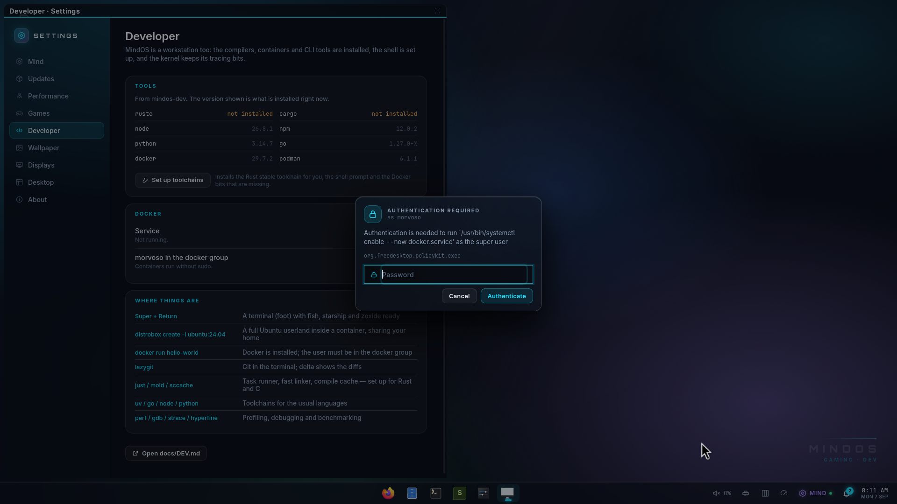
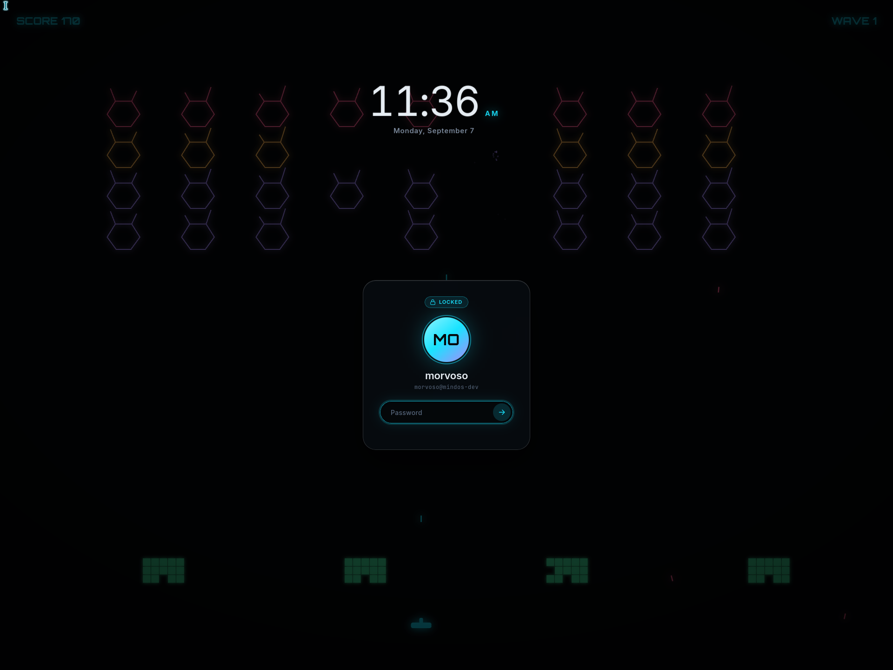
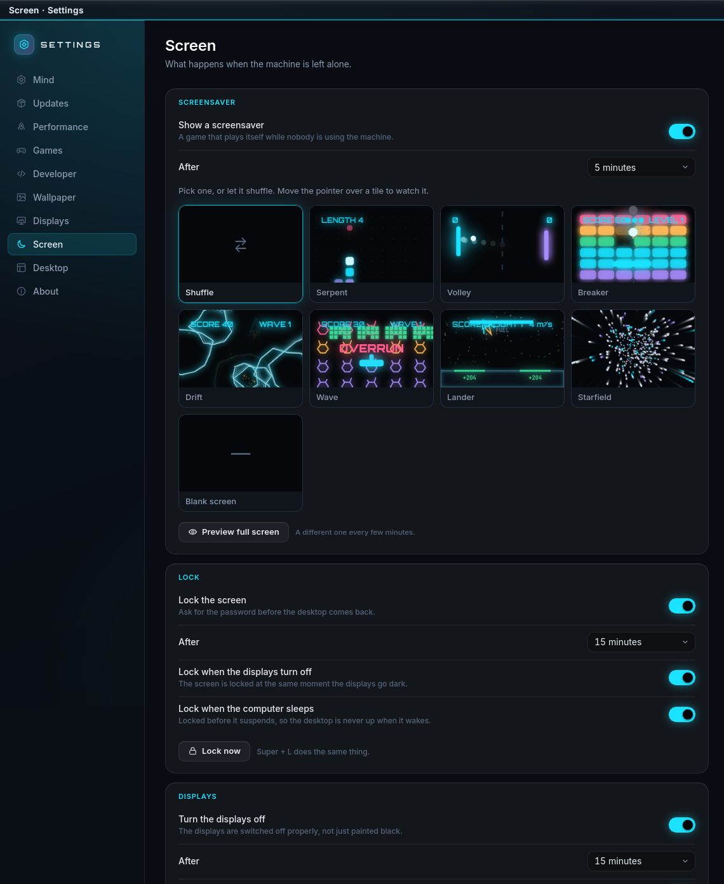
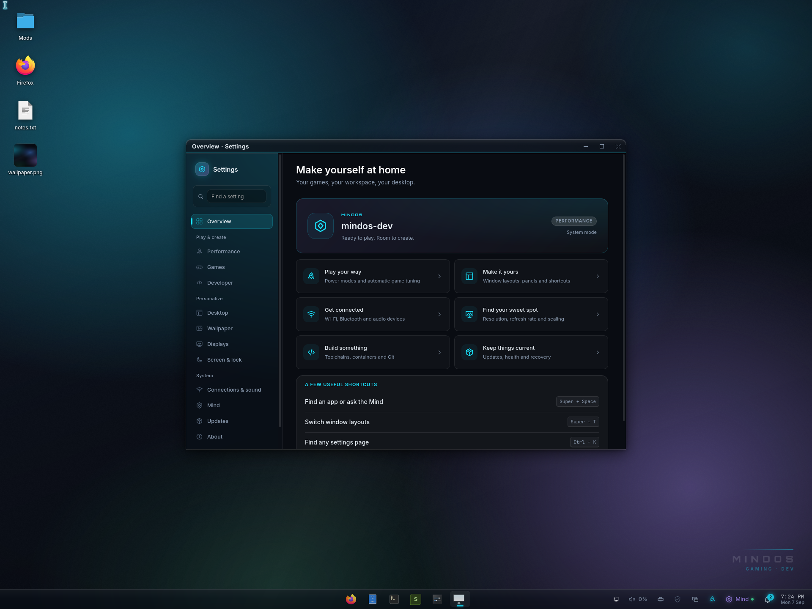

# mindshell — the MindOS desktop shell

The [gaming desktop](GAMING-DESKTOP.md) adds the installed-game shelf, local
Mind and system panels, light/dark appearance, and a togglable live circuit
background. `mindshell --app library` opens the same library in an ordinary
window. Desktop layer surfaces accept keyboard focus on interaction so search
and keyboard navigation work without opening a separate application.

`mindshell` is the MindOS desktop environment: the dock, the top bar
(system tray, clock, layout switcher), desktop widgets, the Settings app and
the login screen. It is one small Rust process (the *host*) that opens layer-shell
windows on the compositor and renders every window with WebKitGTK; the user
interface itself is HTML/CSS/TypeScript (`mindshell/ui`). The host owns
everything that needs the system (D-Bus, the compositor IPC, files,
processes); the UI owns everything visual and is hot-reloadable. There is no
launcher button: `Super+Space` opens the compositor's Mind bar, which
launches programs, runs commands and talks to the Mind.

```
mindwm ──(layer-shell + IPC socket)── mindshell host ──(bridge)── WebKit UI
                                          │
                                          ├── StatusNotifier (tray) on D-Bus
                                          ├── desktop entries + icon themes
                                          ├── wpctl / nmcli / sysfs / procfs
                                          └── ~/.config/mindos/shell/layout.json
```


Design rules: minimal, dark, futuristic. One accent (electric cyan). Red is
reserved for the kernel/boot stages and never appears in the shell. No blur,
no animations that cost GPU time while a game runs — the host says when one
is (`game`), and the pages drop their transitions, animations and
`backdrop-filter`s and slow their samplers until it ends. Everything is a *widget*
in a *container* (panel or desktop); the layout is data (`layout.json`) and
the whole desktop is rebuilt from it, so *edit mode* is just editing that
data with a nicer UI.

## Processes and files

| What | Where |
|---|---|
| host binary | `/usr/bin/mindshell` |
| UI bundle (built by esbuild) | `/usr/share/mindos/shell/ui/` (`index.html`, `app.js`, `app.css`, `fonts/`) |
| default layout | `/usr/share/mindos/shell/layout.json` |
| user layout | `~/.config/mindos/shell/layout.json` |
| host config | `/etc/mindos/shell.toml`, `~/.config/mindos/shell.toml` |
| user service | `mindos-shell.service` (systemd --user, `Type=notify`, `Restart=on-failure`), started and waited for by `session-startup` |
| log | `journalctl --user -u mindos-shell` |
| app windows | `mindshell --app settings [--page home\|performance\|games\|software\|connections\|mind\|updates\|wallpaper\|displays\|screen\|shell\|about]`: an ordinary toplevel (app id `mindos-settings`) with the compositor's title bar; desktop entries `mindos-settings`, `mindos-displays`, `mindos-wallpaper`. `--app library`, `--app gaming` and `--app tasks` (the Task Manager, `mindos-tasks.desktop`, `Ctrl+Shift+Escape`) open the same way. Files is Nautilus (`mindos-apps`), not a shell window |

Environment: `WAYLAND_DISPLAY` (from the compositor), `MINDWM_SOCKET` (the
compositor IPC socket, exported by mindwm to everything it spawns and imported
into `systemd --user` by `session-startup`), `MINDSHELL_UI_DIR` (override the
UI bundle location, for development), `MINDSHELL_DEVTOOLS=1` (enable the
WebKit inspector, `mindshell --devtools` does the same).

`shell.toml`:

```toml
[shell]
# icon_theme = "breeze-dark"     # unset: follow the desktop's icon pack (see below)
hardware_acceleration = "always" # always | never (WebKit compositing policy)
terminal = "kitty"
icon_size = 48                   # dock / taskbar icon size in logical pixels
```

Icons — the applications, the tray and the desktop — come from the icon pack
the desktop is set to: GTK's `gtk-icon-theme-name`, which it takes from the
settings portal (`org.gnome.desktop.interface icon-theme`, defaulted to
`breeze-dark` by `90_mindos.gschema.override`) and from the `settings.ini`
files in `/etc/mindos/xdg`. Change it (`gsettings set
org.gnome.desktop.interface icon-theme Papirus-Dark`) and the shell re-draws
its icons with the applications', without a restart. `icon_theme` in
`shell.toml` pins one theme instead and stops the shell following.

## Applications at login

Applications can use their normal **Start at login** option. Standard desktop
entries in `~/.config/autostart/` run once per session through systemd's XDG
autostart generator. The defaults in `/etc/mindos/xdg/autostart/` and
`/etc/xdg/autostart/` follow; a user file with the same filename overrides them.
To disable a default, copy its desktop entry into your autostart directory and
set `Hidden=true`. `OnlyShowIn`, `NotShowIn` and `TryExec` are respected. Changes
take effect at the next login. The network applet uses this path with its tray
indicator enabled, avoiding a second custom launcher.

Inspect startup apps with `systemctl --user list-units 'app-*@autostart.service'`
and `journalctl --user -b`. Managed apps stop on logout. MindOS's existing
executable hooks in `~/.config/mindos/autostart/` remain supported; use a desktop
entry or a user service tied to `graphical-session.target` for a background
process that needs automatic session cleanup.

Advanced environment overrides for the generator belong in
`~/.config/environment.d/90-local.conf` (`KEY=value`, without `export`), followed
by a fresh login. The default `XDG_CONFIG_DIRS` is
`/etc/mindos/xdg:/etc/xdg`. Session-specific application exports can still go in
`~/.config/mindos/session-env`; these do not change the generator's search paths.

## Keyboard and mouse

Settings → **Keyboard & mouse** controls the session's keyboard layout, repeat
rate/delay and mouse behavior. Choose a layout, apply it and try it in the typing
area. **Discard edits** restores unsaved controls to the last saved values.
**Choose defaults** stages a reset; **Apply input settings** makes it active.
Repeat rate `0` disables repetition. These are desktop-session settings; the
login screen uses its own system keyboard environment.

Advanced options accept XKB layout, variant and option names. For example,
custom layouts `us,de` with `grp:alt_shift_toggle` let Alt+Shift switch between
them; `compose:ralt` makes Right Alt a Compose key. An unbuildable keymap is
rejected while the current one stays active. A bad saved keymap falls back to
the system layout at the next session start.

Mouse controls include acceleration profile, speed, left-handed buttons and
natural scrolling. The flat profile applies constant scaling; games receiving
unaccelerated relative motion retain their own sensitivity. Controls apply to
supported mice/pointing sticks, including devices connected later. Touchpad
tapping and gestures retain libinput's defaults. The device list reports actual
profile/speed and distinguishes absolute virtual pointers without acceleration.
Reopen the page to refresh a changed device list.

Preferences live in `~/.local/state/mindos/mindwm.json` under `input`. The
`get_input` compositor request reports both saved settings and connected mouse
state; `set_prefs` accepts a partial `input` object. The shell's `input.get`
bridge uses that read-only request. No input polling runs while the page is idle.

Hardware volume, mute, microphone mute, brightness and media keys work directly.
A compact dark feedback card stays visible over fullscreen games without taking
focus, then fades away. Hold volume or brightness to repeat 5% adjustments;
keyboard volume stops at 100%. Missing backlights or players show “Unavailable”.
Playback uses the first available MPRIS player. Settings → Desktop lists these
controls alongside the window shortcuts.

**Desktop** lists the window shortcuts. `Alt+F4` (or `Super+Q`) closes the
focused app. `Alt+Tab` and `Super+Tab` switch recent visible windows: hold the
modifier to keep cycling, add Shift to move backward, release to confirm, or
press Escape to return to the original window. A quick second Alt+Tab returns
to the previous app. Minimized apps remain available in the dock. Switching
away from a fullscreen game reveals the chosen app without taking the game
out of fullscreen. Caps Lock does not change Super shortcuts. Applications
that inhibit desktop shortcuts retain their key events.

## Layout (`layout.json`)

The default (`mindshell/data/layout.json`): one floating 64 px shelf along the
bottom edge, Windows-style — the task bar centred on the screen; the tray,
status widgets, Mind and the clock at the right; the Desktop folder as icons
on the wallpaper and no desktop widgets. It is only a default: edit mode
moves panels to any edge, adds a dock (a fit-to-content panel) or a top bar,
adds widgets and re-orders them. `version` is the layout format: a saved
layout from before version 2 gains the `perf` and `notifications` widgets
beside its `mind` widget when it loads, one from before version 3 gains the
`updates` indicator in front of its bell, one from before version 4 loses the
`network` and `vpn` widgets from any panel that has a `tray`, and one from
before version 5 gains the `desktop-view` indicator at the near end of its
first panel (`Layout::sanitized` migrates, `normalizeLayout` does the same in
the UI for a layout the host never saw, and the next save writes version 5).

```json
{
  "version": 5,
  "panels": [
    {
      "id": "bar",
      "output": "*",
      "edge": "bottom",
      "size": 64,
      "length": 100,
      "align": "center",
      "margin": 8,
      "layer": "top",
      "opacity": 0.9,
      "float": true,
      "autohide": false,
      "widgets": [
        { "id": "view", "type": "desktop-view", "config": {} },
        { "id": "sp-l", "type": "spacer", "config": { "expand": true } },
        { "id": "tasks", "type": "taskbar", "config": { "pins": ["firefox.desktop", "org.gnome.Nautilus.desktop", "kitty.desktop", "steam.desktop", "mindos-settings.desktop"] } },
        { "id": "sp-r", "type": "spacer", "config": { "expand": true } },
        { "id": "tray", "type": "tray", "config": {} },
        { "id": "audio", "type": "audio", "config": {} },
        { "id": "net", "type": "network", "config": {} },
        { "id": "vpn", "type": "vpn", "config": {} },
        { "id": "bat", "type": "battery", "config": {} },
        { "id": "mode", "type": "layout-mode", "config": {} },
        { "id": "perf", "type": "perf", "config": {} },
        { "id": "mind", "type": "mind", "config": {} },
        { "id": "updates", "type": "updates", "config": {} },
        { "id": "notify", "type": "notifications", "config": {} },
        { "id": "clock", "type": "clock", "config": { "seconds": false, "date": true, "hour24": false } }
      ]
    }
  ],
  "desktop": {
    "wallpaper": { "mode": "builtin" },
    "icons": true,
    "widgets": []
  }
}
```

* `panel.output`: `"*"` means one instance of the panel on every output;
  otherwise a connector name (`DP-1`, `Virtual-1`).
* `edge`: `top | bottom | left | right`. `size` is the thickness in logical
  pixels (also the exclusive zone). `length` is a percentage of the edge
  (100 = full width); `0` means *fit to content*: the panel is as long as its
  widgets and grows and shrinks with them (the dock). `align`:
  `start | center | end` when `length < 100`. `layer`: `top` (normal) or
  `bottom` (windows cover it, like a dock that hides under maximized
  windows). `margin`: distance from the edge. `opacity` is the panel
  background's alpha (`0` = the widgets float on the wallpaper, macOS-style);
  `autohide` slides the panel away until the pointer touches its edge.
  `float`: `true` draws the bar as a rounded island inset from the edge,
  `false` flush with the edge (one hairline on the inner side); when unset a
  panel thicker than 30 px floats and a thinner one is flush. The renderer
  puts a `floating` or `edge` class on the panel window and `app.css` gives
  `floating` a non-zero `--inset` whatever the thickness, so the switch bites
  on a thin bar too.
* Widgets are ordered left→right (or top→bottom on vertical panels). A
  `spacer` with `expand: true` pushes what follows to the far end. With two
  expanding spacers the widgets between them are centred on the bar itself
  (the Windows way: a wide tray does not push the apps off centre); if the
  sides leave no room the spacers fall back to sharing the space equally.
* Desktop widgets have a position/size in logical pixels on their output.
* `desktop.icons` (default `true`) shows the Desktop folder (`fs.desktop`:
  the XDG desktop directory, `~/Desktop` otherwise, created if missing) as
  icons on the wallpaper, column by column from the top left, clear of the
  panels. Click selects (Ctrl adds), double-click opens (`.desktop` files
  show as and launch their application, folders open in the file manager),
  right-click offers open / show in Files / move to trash; the desktop's own menu toggles
  the icons. The host watches the folder and broadcasts `desktop.changed`.
* Unknown widget types render as an "unavailable" placeholder and are kept.

### Widget types (v1)

| type | container | what |
|---|---|---|
| `taskbar` | panel | the shortcuts, a separator, then the open windows grouped by application: `<pins> │ <running>`. A pin is a launcher and never moves as windows come and go (it carries a faint ring while its application is open); `mergePinned` folds the windows back into their pin, which is how the widget used to behave. Click a group of one focuses it (a second click minimises in floating mode; tiles are never minimised, the columns strip slides to the window instead), a group of several opens its window list, middle-click starts a new instance, scroll cycles the group's windows, right-click gives the per-window menu plus pin/unpin/close. Under each icon is one mark per window — filled open, hollow minimised, long and lit for the focused one — with a count chip past one window. A corner badge says where the windows come from: the four panes for a Windows program (Wine or Proton: a window with `wine: true`, or an entry with `wine: true`), an X for Xwayland, the penguin for a native client; `osBadge` chooses `off`, `foreign` (Wine and X11 only, the default) or `all`. Entries are matched to their windows through `wmClass` first. Icons grow with the panel unless `iconSize` pins them. Settings: `pins` (desktop ids), `showRunning` (off = a launcher of pinned apps only), `mergePinned`, `separator`, `onlyThisOutput`, `preview`, `previewDelay`, `labels`, `maxLabel`, `indicator`, `osBadge`, `iconSize` (0 = follow the panel) |
| `spacer` | panel | flexible or fixed gap (`expand`, `size`) |
| `clock` | panel | time (+ date); click opens the calendar popup. Settings: `hour24` (default false: 12-hour with AM/PM), `suffix`, `leadingZero`, `seconds`, `date`, `dateFormat` (`short` Sun 6 Sep / `long` / `numeric` / `iso` / `weekday`), `stack` (date under the time), `size` (`small`/`normal`/`large`), `weekStart` (`monday`/`sunday`, for the calendar) |
| `layout-mode` | panel | the compositor's window layout (floating / tiles / columns) as an icon; click opens the layout picker popup. Setting: `label` |
| `desktop-view` | panel | which of the two views the primary screen is in: a small screen mark, lit with an accent fill for the home screen and showing a grey window shape for the windows. It is the one thing on screen in both views, which is why it lives in the panel. Click switches, the same as Super + D (`desktop.toggle`); it dims when nothing is open, since the home screen is then the only view there is. Setting: `label` (Home / Windows beside the mark) |
| `tray` | panel | StatusNotifierItems plus the compositor's XEmbed icons (Wine, older X11 programs; `xembed: true`, ids `x11:<window>`, no menu of their own: right-click is replayed as a right-click); left-click activate, right-click menu, scroll. The icon follows the panel's thickness unless a size is set. Settings: `hidePassive`, `iconSize` (0 = follow the panel) |
| `audio` | panel | default sink volume; scroll adjusts, click opens the slider popup, middle-click mutes. Settings: `percent`, `scroll`, `step`, `hideWhenMuted` |
| `network` | panel | wired/wifi state. Settings: `name`, `ip` |
| `vpn` | panel | WireGuard tunnels (NetworkManager connections of type `wireguard`): a shield, lit green while a tunnel is up, with the tunnel's name; click opens the tunnel list popup (a switch per tunnel, details on click: interface, address, endpoint, connect at start-up, remove; *Import…* opens a file chooser for a wg-quick `.conf`), middle-click drops the active tunnel or brings up the only one. Settings: `name`, `hideWhenNone` |
| `battery` | panel | charge state (hidden when no battery). Settings: `percent`, `warnAt`, `alwaysShow` |
| `mind` | panel | Mind (mindd) status; click toggles the Mind bar. Settings: `label`, `model` |
| `updates` | panel | the updates indicator: how many package updates the Mind's watcher found, amber when it rates them high-risk or they need a hand; hidden while the system is up to date; click opens Settings › Updates. Settings: `count`, `alwaysShow` |
| `notifications` | panel | the bell: applications' notifications plus the Mind's notices that need attention, with a count badge (do-not-disturb crosses the bell out); click opens the notification centre popup. Setting: `count` |
| `perf` | panel | the performance mode (`mindos-perf`: balanced / performance / quiet) as an icon, pulsing while GameMode has a game running; click opens the mode picker popup. Setting: `label` |
| `sysmon` | panel | compact CPU / memory / GPU bars; click opens the Task Manager. Settings: `cpu`, `memory`, `gpu`, `interval` |
| `power` | panel | power menu button. Setting: `label` |
| `desktop-clock` | desktop | large clock + date. Settings: the clock's time/date ones plus `year`, `size` (px), `align`, `glow` |
| `desktop-sysmon` | desktop | CPU / memory / GPU graphs. Settings: `title`, `cpu`, `gpu`, `memory`, `interval`, `history` (samples), `fill` |
| `desktop-tasks` | desktop | the system readout: the processor/graphics graph, three meters, the network, disk and container line, the busiest processes and a link to the Task Manager — the same card the desktop rails carry, off the same shared sample. Settings: `title`, `graph`, `traffic`, `processes`, `link`, `interval` |
| `desktop-notes` | desktop | a sticky note (plain text, stored in the widget config). Settings: `title`, `fontSize`, `mono` |

Every widget's settings are reachable without edit mode: right-click the
widget (a panel widget or a desktop one) and pick *… settings*; the same
menu offers *Edit the panel* / *Edit desktop*, *Add widget* and *Remove*.
Changes apply and save as they are made; *Defaults* clears the widget's
config. In edit mode the gear button on each widget opens the same form.

Adding a widget type = one TypeScript module registering `{ type, name,
description, containers, defaults, settings?, create(ctx) }` in the widget
registry.

Only a clickable surface lights up under the pointer. `panelItem()`
(`widgets/common.ts`) adds the `tap` class that the hover rule keys off, and
a widget with nothing to press passes `tap = false` — a spacer, a meter or a
read-out stays put when the pointer crosses it.

## Windows the host creates

One WebKit view per window; all views share one web process (`related-view`)
and one `mindos://shell/` origin.

| kind | layer-shell | where |
|---|---|---|
| `desktop` (one per output) | `background` normally and `top` while it is forward (`desktop.panel`, see *The home screen and the windows*), anchored to all edges, exclusive −1, keyboard `on-demand` | wallpaper, desktop icons, desktop widgets, the home screen, edit-mode toolbar, right-click menu, and the system pages (Settings, the Gaming Center, the library) |
| `panel` (one per panel × output) | `top`/`bottom` per layout, anchored to the panel edge (+ both sides when `length` = 100), exclusive zone = `size` + `margin`, keyboard `none` | the panel and its widgets; in edit mode the window is enlarged by 140 px toward the screen centre (exclusive zone unchanged) to show the panel settings strip, and at runtime by whatever a flyout asks for (`panel.flyout`) |
| `popup` (transient) | `overlay`, anchored to all edges (full output, transparent), keyboard `exclusive` when `keyboard: true` else `on-demand` (the compositor hands an on-demand popup the keyboard as soon as it maps) | calendar, layout picker, audio slider, power menu, tray menus, widget catalog, widget settings, context menus, the authentication dialog. Clicking the transparent area or pressing Escape closes it |
| `app` (`mindshell --app <name>`) | a normal xdg toplevel, no client decorations (the compositor draws the title bar), app id `mindos-<name>` | Settings, the Library, the Gaming Center and the Task Manager; one process per window, `app.close` ends it |
| `toast` (one, on the primary output) | `overlay`, anchored top + right with a 12 px margin, exclusive zone 0, keyboard `none`; sized by the UI (`toast.fit`) and hidden while empty | the notification toasts: new application notifications and Mind notices slide in here and expire (never for critical ones) |
| `lock` (one per output, while the screensaver is up or the session is locked) | `overlay`, anchored to all edges, exclusive −1, keyboard `exclusive` on the first output while locked and `none` otherwise; namespace `mindshell-lock`, which is how the compositor tells it apart | the screensaver and the lock screen. The compositor creates the need for it (its `idle` event) and enforces it: while the session is locked nothing but these surfaces is drawn or reachable |
| `greeter` (`mindshell --app greeter`, one per output) | `overlay`, anchored to all edges, exclusive −1, keyboard `exclusive` on the first output and `none` on the others | the login screen: wallpaper and clock everywhere, the login card, the other accounts, the session and the power buttons on the first output. Started by greetd through `mindos-greeter` (see *The login screen* below) |


### The home screen and the windows

The home screen — the workspace the primary display shows, on whichever space —
is an overlay, not a permanent ground. With nothing open it is the whole
screen. The moment a window opens it crossfades away and leaves the windows
over the wallpaper, the desktop icons and any desktop widgets. Closing the
last window brings it back. **Super + D** asks for it over the top of the
windows in between, and the panel's `desktop-view` widget says which of the
two views the screen is in and switches between them.

Settings, the Gaming Center and the library are apps with windows of their
own; the home screen holds the space's shortcuts, notes and Resume playing.
It lives *behind* the windows, so it has to come forward to be read, and the rule for when it does has to be
one the user can predict:

* It comes forward when the user asks for it — **Super + D**, or the view indicator.
* It goes back when a window takes the keyboard, and only then. A window
  taking focus is a *transition* in the compositor's `windows` event: the same
  window reporting focus again is a relayout, a title change or a window
  opening on another screen, and none of those touch the desktop. Switching
  between tiles and columns leaves the desktop where it is.
* Escape sends it back too, and so does the panel, which stays above the
  desktop as the way out.

Being forward is state (`ShellWindow::presenting`), not a one-off layer change:
every `apply_geometry` honours it, or a panel edit or a monitor change would
drop an open page behind the tiles.

**Two different fades**, and which one runs is the whole trick
(`ui/src/workspace.ts`). At ground level — a window opening, the last one
closing — the surface never moves: only the workspace element's own opacity
changes, so there is no layer change, no repaint of the ground, and nothing
for the compositor's startup screen to show through. Summoning it *over* the
windows is the surface's own fade, run by the host in the same frame as the
layer change (`present_desktop`), with the workspace element set straight to
full opacity underneath it — fading both at once would show the crossfade
twice over. Coming back down, the element holds its opacity until the surface
fade is over (`desktop.away`) for the same reason. Summoned over windows that
have since closed, the home screen is the ground again: it drops back a layer
with `fade: false`, which nothing on screen can see.

Going away is instant; coming back waits 180 ms. An application that replaces
its own window — a splash screen, a relaunch — would otherwise flash the home
screen between the two.

**The bar stays; the room it takes is reserved.** The bar along the top of
the home screen is on screen in both views — it does not fade with the rest —
so windows have to be kept out of the strip it covers. Nothing reserves that
strip through layer-shell: the desktop window is anchored to every edge, so
reserving from it would claim the whole screen. Instead the page measures how
far down the bar reaches and reports it (`desktop.bar` → `desktop_bar` IPC),
and the compositor takes it off the usable area (see *Maximised means the
usable area* in COMPOSITOR.md). The measurement is sent again whenever the bar
resizes or the user's panels move it, and only when it has changed. The user's
own panels stay visible in both views as they always did, and tiles and
columns fit between them and the bar. The desktop icons keep clear of it too:
the same measurement is handed to `geometry.ts` (`setDesktopBar`), and the
icon grid takes the larger of it and the top panel's edge (the measurement
already counts a panel above the bar) as its top padding.

**While it is off screen it stops sampling.** Everything below the bar is
taken out of the layout (`.gaming-workspace.is-away`) rather than left
transparent, and `.gaming-active` takes the desktop icons
and desktop widgets out of the layout the other way round, so exactly one of
the two sets of widgets is drawn at a time. `every()` skips a tick for
anything that is not drawn (`dom.ts`), so a widget behind the home screen
stops reading the machine; `shell.resume` makes the ones that come back take
their skipped tick at once instead of waiting out an interval.

When the fade out is over, `desktop.away` tells the page to put the system
page away — it stays mounted, so summoning the desktop again returns to it,
but what shows between the windows is the desktop and not a settings page
nobody is looking at. With nothing open the home screen is still being looked
at, so nothing is put away.

While a game is fullscreen the compositor draws the game alone, layer surfaces
included, so the desktop cannot come forward over it.

Every window loads `mindos://shell/app/index.html?kind=<kind>&id=<id>&output=<name>`
(`&popup=<name>&arg=<json>` for popups). `?kind=preview` renders every
window stacked on one page: it is what `make shell-preview` screenshots in
Chromium for design work without a compositor.

## The bridge (`window.mindos`)

Injected into every view before any script runs.

```ts
mindos.call(method: string, params?: object): Promise<any>   // request → host
mindos.on(event: string, cb: (payload: any) => void): () => void
mindos.window: { kind, id, output, popup?, arg? }            // parsed from the URL
```

Transport: `window.webkit.messageHandlers.mindos.postMessage(JSON.stringify({id, method, params}))`;
the host answers with `window.mindos._reply(id, ok, payload)` and pushes
events with `window.mindos._dispatch(event, payload)`. When the page is not
inside the host (a browser), `src/mock.ts` installs a fake host with sample
data so the UI can be developed in Chromium/Firefox.

### Methods

| method | params → result |
|---|---|
| `shell.state` | → `{ user, host, uptime, outputs, windows, focused, apps, tray, layout, editMode, desktopHome, config, polkit }` |
| `shell.ready` | the view has rendered its first frame |
| `shell.setEditMode` | `{ enabled }` → broadcasts `edit_mode` |
| `shell.exec` | `{ cmd }` runs a command line in the session (`sh -c`) |
| `shell.reload` | reloads every view (development) |
| `layout.get` | → `layout` |
| `layout.save` | `{ layout }` → validates, applies it (windows are rebuilt only when the panels changed), broadcasts `layout`; the user file is written once the changes settle (half a second; at once from an `--app` window) |
| `layout.reset` | back to the default layout |
| `popup.open` | `{ name, keyboard?, anchor?: {x,y,w,h,edge}, arg? }` → opens (or moves) the popup on the calling window's output |
| `popup.close` | `{ name }` (or none = the calling popup) |
| `popup.toggle` | as `open`, but closes when already open |
| `windows.focus` | `{ id }` (unminimises) |
| `windows.close` | `{ id }` |
| `windows.minimize` | `{ id }` |
| `windows.toggleMinimize` | `{ id }` |
| `apps.list` | → `[{ id, name, comment, exec, icon, categories, terminal, wmClass, wine }]` (`icon` is a `mindos://shell/icon/...` URL; `wmClass` is the entry's `StartupWMClass`; `wine` marks an entry whose Exec runs `wine`/`proton`, such as the ones Wine's menu builder writes under `applications/wine/`) |
| `apps.launch` | `{ id }` or `{ exec, terminal }` |
| `tray.items` | → `[{ id, title, tooltip, icon, status, hasMenu }]` |
| `tray.activate` / `tray.secondaryActivate` | `{ id, x, y }` |
| `tray.scroll` | `{ id, delta, orientation }` |
| `tray.menu` | `{ id }` → `[{ id, label, enabled, type: "item" \| "separator" \| "submenu", toggle?: "checkmark" \| "radio", checked?, icon?, children? }]` |
| `tray.menuClick` | `{ id, item }` |
| `mind.toggle` / `mind.open` / `mind.close` | opens/closes the compositor's Mind bar; `open` takes `{ text?, ask? }` to prefill the field (and, with `ask`, send it as a question at once) |
| `mind.status` | → `{ connected, ready, model, daemon, sleeping, notices, updates, health }` (`daemon`: the shell's own subscription to mindd is up; `sleeping`: the model is unloaded, GameMode does that while a game runs) |
| `mind.request` | `{ request }` (a `{ type, ... }` object for mindd: `models`, `set_model`, `set_thinking`, `download_model`, `cancel_download`, `status`, `notices`, `dismiss_notice`, `updates { check }`, `apply_updates`, `set_auto_update { enabled }`, `health`, `set_sleep { sleeping }`, `power { action }`, `rollback { snapshot }`) → the first event the daemon answers with (the Settings page polls `models` while a download runs) |
| `mind.notices` | → `{ notices: [{ id, level: "info" \| "warn" \| "danger" \| "ok", title, body, source: "updates" \| "health" \| "mind", time, actions: [{ label, kind, arg }] }] }` |
| `mind.dismiss` | `{ id }` (`"*"` = all) → drops the notice locally and in mindd |
| `mind.act` | `{ action: { kind, arg } }` carries out a notice action: `chat` opens the Mind bar with `arg` as the question, `request` sends the mindd request in `arg`, `command` runs `arg` in the session, `settings` opens the Settings page named by `arg` |
| `notify.list` | → `{ items: [{ id, app, desktop, icon, summary, body, actions: [{ key, label }], urgency, resident, transient, category, timeout, time, replaced, quiet }], dnd }` (the freedesktop notification server the host runs on the session bus; `icon` is a URL — `mindos://shell/notify/<id>` for `image-data`) |
| `notify.close` | `{ id, reason? }` (1 expired, 2 dismissed — the default —, 3 closed by a call) → `{ closed }`; the application gets `NotificationClosed` |
| `notify.action` | `{ id, key }` → the application gets `ActionInvoked`; the notification closes unless it is `resident` |
| `notify.clear` | closes every notification |
| `notify.setDnd` | `{ enabled }`: do not disturb — notifications still collect, only critical ones toast |
| `toast.fit` | `{ w, h }` from the toast window: the host resizes it (and hides it when `h` ≤ 1) |
| `polkit.respond` | `{ id, password }` from the `auth` popup: the password for the authorisation the host is waiting on |
| `polkit.cancel` | `{ id }`: the user dismissed the authentication dialog |
| `shell.run` | `{ argv }` runs one of the system helpers and → `{ status, ok, stdout, stderr, json }` (`json` is the parsed stdout when it is JSON). Allowed: `mindos-perf status\|get\|modes\|set\|config\|apply` (also behind `sudo -n`), `mindos-dlss …`, `mindos-dev-setup …`, `mindos-boot list`, `pacman -Q…`, `checkupdates`, `nvidia-smi …`, `pkexec systemctl enable\|disable --now <docker.service\|sshd.service>`, `pkexec usermod -aG <docker\|kvm\|libvirt\|uucp\|wireshark> <the session user>`, `pkexec mindos-pkg install <a package from `DEV_PACKAGES`>` (those three go through the authentication dialog below), and unprivileged `ssh-keygen -t ed25519 … -f ~/.ssh/id_ed25519`, `cat ~/.ssh/*.pub`, `git config --global user.name\|user.email <value>` |
| `panel.fit` | `{ panel, length }` (content length in logical pixels) from a `length: 0` panel: the host resizes the panel window and answers `{ length }` |
| `panel.flyout` | `{ panel, size }` (extra thickness in logical pixels, 0 to give it back): the panel window grows toward the screen centre so a widget can draw a card beside itself. The exclusive zone is untouched, so nothing on the screen moves; the runtime twin of edit mode's settings strip |
| `desktop.panel` | `{ active, fade? }` from a desktop window: bring the home screen forward over the windows, or send it back behind them. The host fades the surface and changes the layer together (see *The home screen and the windows*). `fade: false` skips the fade, for the case where the same page is on screen before and after and only the layer under it moves |
| `desktop.bar` | `{ size }` from a desktop window: how far down the screen the home screen's bar reaches, in logical px, 0 for a screen without one. Forwarded to the compositor as `desktop_bar` when it has changed, which is what keeps windows out of the strip (see *The home screen and the windows*) |
| `desktop.view` | `{ home }` from a desktop window: which view the primary screen is in. Kept in `shell.state.desktopHome` and broadcast as `desktop_view`, so a panel that starts later still knows |
| `desktop.toggle` | none, from the panel's view indicator: broadcasts `shortcut` `desktop`, the same route Super + D takes — the desktop decides what the switch means, and there is one rule for it |
| `wm.layoutMode` | → `{ mode, label, modes: [{ mode, label, description }] }` |
| `wm.setLayoutMode` / `wm.cycleLayoutMode` | `{ mode }` / none → the new `{ mode, label }`; also broadcast as `layout_mode` |
| `wm.setDesk` / `wm.getDesk` | `{ desk, sticky?, mode? }` / none → `{ desk, sticky }`: the space on screen, the apps shown on every space, and the space's window layout; changes are broadcast as `desk` |
| `wm.moveToDesk` | `{ id, desk }`: move a window to another space |
| `wm.outputs` | → `{ outputs }` with the compositor's full output records (modes, position, transform, VRR, primary) |
| `wm.setOutput` | `{ name, width?, height?, refresh? (mHz), scale?, position?: [x, y], transform?, enabled?, vrr?, primary? }` → applied and persisted by the compositor |
| `prefs.get` / `prefs.set` | none / `{ prefs }` → `{ prefs }` (compositor preferences: `layout_mode`, `mind_show_tools`, `primary_output`, `cursor_theme`, `cursor_size`, `outputs`); `prefs` is broadcast on every change |
| `pointer.get` | → `{ theme, size, themes, sizes, writable }`: the cursor theme and its size from `org.gnome.desktop.interface`, and every installed theme (a directory with a `cursors/` folder in it) |
| `pointer.set` | `{ theme?, size? }` → the new `pointer.get`: writes GSettings (GTK applications follow it at once through the settings portal) and forwards it to the compositor as `cursor_theme` / `cursor_size`, which reloads its own cursor and passes the size to what it starts next |
| `wallpaper.list` | → `[{ path, name, folder }]`: the images in `/usr/share/mindos/wallpapers`, `~/.local/share/mindos/wallpapers` and `Wallpapers/` under the pictures folder (images are shown through `mindos://shell/thumb/`) |
| `fs.desktop` | → `{ path }` the Desktop folder shown as icons |
| `fs.list` | `{ path, hidden? }` → `{ path, parent, entries: [{ name, path, dir, size, mtime, hidden, symlink, mime, icon, image }] }` |
| `fs.trash` | `{ paths }` → `{ count }` (through GIO, so it lands in the freedesktop trash) |
| `fs.open` | `{ path }` → opens with the default application for the file's MIME type (GIO; a folder opens in the file manager, `Terminal=true` entries get the configured terminal) |
| `shell.openApp` | `{ name, page?, arg? }` → spawns `mindshell --app name`; settings, library, gaming and tasks run once, so an open one is handed the page instead and comes forward |
| `app.close` / `app.setTitle` | none / `{ title }` (app windows only) |
| `system.power` | `{ action: "shutdown" \| "reboot" \| "suspend" \| "logout" }` |
| `greeter.info` | → `{ users: [{ name, display, avatar? }], sessions: [{ id, name, exec }], last: { user?, session? }, host }` (login screen only; accounts with a login shell and a uid from 1000, `/usr/share/wayland-sessions`, `/var/lib/AccountsService/icons`) |
| `greeter.login` | `{ user, password, session }` → `{ status: "started" }` \| `{ status: "prompt", secret, message, notes }` \| `{ status: "failed", message, notes }` (the greetd conversation; a `prompt` is answered with `greeter.respond { response, session }`, dropped with `greeter.cancel`) |
| `greeter.done` | after `started`: asks the compositor to quit so greetd starts the session |
| `greeter.power` | `{ action: "poweroff" \| "reboot" \| "suspend" }` |
| `system.stats` | → `{ cpu, memUsed, memTotal, gpu?: { util, temp, mem, memTotal, name }, load, uptime }` |
| `system.overview` | `{ parts?: ["storage", "net", "sensors", "host", "containers"], top?: n }` → `{ at, cpu, memory, gpus }` plus the parts asked for (no `parts` means all of them) and the `top` busiest processes. One call is the whole readout |
| `system.processes` | `{ query?, sort?, order?, limit?, mine? }` → `{ processes, total, matched, threads, states, cores, uid }`: filtered, sorted and cut in the host, so a thousand processes never cross the bridge |
| `system.process` | `{ pid }` → one process in full: command line, executable, working directory, parent, threads, the four `Vm*` figures, open descriptors, bytes read and written, cgroup, context switches, and whether it is running under Wine |
| `system.kill` | `{ pid, signal?: "TERM" \| "KILL" \| … }` → `{ pid }` (a plain `kill(2)`; the caller's own privileges apply) |
| `system.containers` | `{ stats?: true }` → `{ docker, podman }`, each `{ available, running, total, containers: […] }`; neither engine is asked anything until its socket answers |
| `system.services` | → `{ available, system, user }`: systemd's units, cached five seconds |
| `audio.get` | → `{ volume, muted, sink }` |
| `audio.set` | `{ volume }` (0..1.5) |
| `audio.toggleMute` | |
| `network.status` | → `{ connected, kind: "ethernet" \| "wifi" \| "none", ssid?, iface, ip? }` |
| `vpn.list` | → `{ available, tunnels: [{ id, name, iface?, address?, endpoint?, peers, active, activating, autoconnect }] }` — every NetworkManager connection of type `wireguard`, active ones first (`id` is the connection UUID; `available` is false without nmcli) |
| `vpn.connect` / `vpn.disconnect` | `{ id }` → the new `vpn.list` (`nmcli connection up/down`; NetworkManager's polkit rules apply, so the authentication dialog may appear) |
| `vpn.autoconnect` | `{ id, on }` → the new `vpn.list` (whether NetworkManager brings the tunnel up at start-up) |
| `vpn.remove` | `{ id }` → the new `vpn.list` (deletes the connection and its keys) |
| `vpn.import` | `{ path? }` → `{ imported, id?, available, tunnels }` — without `path` a native file chooser asks for a wg-quick `.conf`; `imported` is false when it was dismissed. NetworkManager names the tunnel after the file and brings it up at once |
| `battery.status` | → `{ present, percent, charging, timeToEmpty? }` |
| `lock.info` | → `{ name, display, avatar, host, idle }` — the account the lock screen unlocks, and where the session stands |
| `lock.state` | → the `idle` payload (`{ stage, locked, inhibited, saver }`) |
| `lock.unlock` | `{ password }` → `{ ok }`, or `{ ok: false, error }` with PAM's own message. Checked against the `mindos-lock` PAM service on a thread of its own; one attempt at a time |
| `lock.now` | lock the session now (the power menu, Settings › Screen, Super + L) |
| `lock.wake` | wake the screen without unlocking |
| `lock.blank` | switch the displays off now |
| `icons.resolve` | `{ name, size }` → URL |

### Events

| event | payload |
|---|---|
| `windows` | `{ windows: [...], focused }` (full snapshot on every change) |
| `outputs` | `{ outputs: [...] }` |
| `apps` | `{ apps }` (desktop database changed) |
| `tray` | `{ items }` |
| `layout` | `{ layout }` |
| `edit_mode` | `{ enabled }` |
| `popup_state` | `{ name, open, output }` |
| `mind` | `{ connected, ready, model, daemon, sleeping, notices, updates, health }` |
| `mind_notices` | `{ notices, added? }` whenever a Mind notice arrives, changes or goes (`added` is the new one; the toast window shows it) |
| `mind_updates` | the mindd `updates` status (`{ checked_at, packages: [{ name, from, to, tag }], news, risk, summary, warnings, manual_intervention, reboot, assessed_by_model, assessing, checking, applying, auto_apply, last_update, error }`) whenever it changes |
| `mind_health` | `{ checked_at, findings: [{ id, level, title, body, actions }] }` after a health check |
| `notify` | `{ items, dnd, added?, closed? }` on every notification change (`added`: the new notification, `closed`: the id that went) |
| `perf_changed` | `{ argv }` after a `shell.run` of `mindos-perf set\|config\|apply` succeeded in any window; read the status again |
| `polkit` | the authorisation the polkit agent is waiting for — `{ id, action, message, icon, user, users, command, error, attempt, tries, busy }` — or `null` when it is done (also in `shell.state.polkit`) |
| `audio` | `{ volume, muted }` |
| `vpn` | the `vpn.list` payload whenever NetworkManager reports a change (the host follows `nmcli monitor`) or a `vpn.*` call changed something |
| `network` | the `network.status` payload, on the same cue |
| `shortcut` | `{ name }` forwarded from the compositor: `overview`, and `desktop` (Super + D) which toggles the home screen over the windows. The panel's view indicator broadcasts the same thing (`desktop.toggle`) |
| `layout_mode` | `{ mode, label, modes? }` whenever the compositor's window layout changes |
| `prefs` | `{ prefs }` whenever a compositor preference changes |
| `desktop.changed` | `{ path }` when something in the Desktop folder changed (debounced) |
| `app.open` | `{ name, page?, arg? }`: a single-instance app was launched again; turn to `page` (the host has already raised the window) |
| `desktop.present` | `{ active: false }` to the desktop that is forward when a window takes the keyboard: fade out |
| `desktop.away` | the desktop has finished fading out |
| `desktop_view` | `{ home }` whenever the primary screen changes view (see `desktop.view`); what the `desktop-view` widget draws |
| `config` | `{ config }` when a host setting changed while the shell runs — today the icon theme, when the desktop's icon pack changes |
| `lock` | `{ stage: "active" \| "screensaver" \| "blank", locked, inhibited, saver }` whenever the compositor's idle state changes (also in `shell.state.lock`) |
| `game` | `{ running }` when GameMode starts or ends a game (the host watches `/run/mindos/perf/game`); the UI goes quiet — `:root.quiet`, no animations, samplers slowed five times, the desktop's stopped |

`mindos://shell/icon/<name>?size=N` serves an icon from the icon theme in force
(`hicolor` fallback, SVG or PNG); an absolute path in place of `<name>` serves
that file. `mindos://shell/tray/<id>` serves a tray item's pixmap.
`mindos://shell/notify/<id>` serves the pixmap a notification carried as `image-data`.
`mindos://shell/file/<absolute path>` serves a file from disk (wallpapers,
image previews) and `mindos://shell/thumb/<absolute path>?size=N` a scaled
thumbnail of an image.
`mindos://shell/app/...` serves the UI bundle; `mindos://shell/app/fonts/...`
serves the bundle's own `fonts/` first and falls back to
`/usr/share/fonts/mindos` and the system font directories.

### Host implementation notes

What `mindshell` (the Rust host in `mindshell/`) does beyond the tables above:

* **Panel `output`.** `*` = every output, a connector name = that output, and
  `primary` (or an empty string) = the first output (top-left in GDK's
  monitor list, which is also `outputs[0]` in `shell.state`).
* **Popup anchors pass through.** `popup.open` / `popup.toggle` take the
  `anchor` in output-local logical pixels, as the UI conventions below say
  (the UI adds the panel window's origin itself); the host does not translate
  it. The popup receives it as `mindos.window.anchor` (the `&anchor=<json>`
  URL parameter) and inside `mindos.window.arg.anchor`, and places itself.
* **Popups.** One window per popup name across all outputs; opening the same
  name from another output moves it (a `popup_state` close for the old
  output, then an open). Re-opening an already open popup on the same output
  re-navigates the view only when its URL (arg/anchor) changed. `popup.toggle`
  replies `{ name, open, output }`. Escape closes a popup at the host level
  (a GTK key controller in the capture phase); clicking the transparent area
  is the UI's `popup.close`. A closed window is unmapped at once but its view
  lives on, hidden, for 1.5 s: a menu that calls `popup.close` and then runs
  its action (`shell.setEditMode`, `popup.open`, `shell.exec`, ...) still gets
  that request answered.
* **`shortcut` events are forwarded only.** The host broadcasts the
  compositor's `shortcut` to every view and opens nothing itself. The
  compositor keeps `Super+Space` for its own Mind bar (there is no launcher
  popup) and only forwards `overview`.
* **Extra methods.** `windows.unminimize`, `windows.toggleFullscreen`,
  `windows.toggleMaximize`, `mind.open`, `mind.close`, `outputs.list`.
  `shell.exec` also accepts `terminal: true`.
* **Extra fields.** `shell.state` adds `compositor` (IPC connected),
  `devtools`, `config.icon_size`; `mind` adds `open` (the Mind bar state) and
  merges whatever the compositor answers to a `mind_status` request or sends
  as a `mind_status` / `mind` event; `audio` adds `available` (false when
  `wpctl` is missing); each app carries `iconName` next to the resolved
  `icon` URL; tray items carry `isMenu` and `app` (the item's D-Bus id);
  `system.stats` gives `load` as `[1m, 5m, 15m]`, `cores`, and `gpu` from
  `nvidia-smi` sampled every 2 s on a thread (null without a GPU).
* **Launching.** `apps.launch` and `shell.exec` go through the compositor's
  `launch` request when the IPC is connected (so the program gets the
  session's environment); otherwise the host runs `sh -c` itself, detached in
  a new session, using `terminal` from `shell.toml` for terminal entries.
* **Icons.** `icons.resolve` answers `null` when nothing matches; `apps.list`
  falls back to `application-x-executable`. The theme is picked at startup
  (the configured one, then breeze-dark, breeze, Papirus-Dark, Papirus,
  Adwaita, hicolor) by looking for `<dir>/<theme>/index.theme`. Tray items
  prefer a themed icon name (also via the item's `IconThemePath`) and fall
  back to their pixmap, served as PNG from `mindos://shell/tray/<id>?v=N`.
* **Unknown compositor events** are broadcast to the views under their own
  name, so the compositor can grow events without a host change.
* **Edit mode** re-fits desktop and panel windows in place (`edit_mode` is
  broadcast after the geometry changed); the panel window grows by 140 px
  toward the centre, the exclusive zone stays `size + margin`.
* **Robustness.** Bad bridge JSON is logged and dropped; a crashed web
  process reloads its view after 500 ms; monitors appearing or disappearing
  re-create the windows (debounced 300 ms so the connector name has arrived);
  the compositor socket is retried with backoff and every state that came
  from it is cleared on disconnect. `GDK_BACKEND=wayland` is forced and the
  host exits with status 1 when the compositor has no layer-shell.
* **Service.** `mindos-shell.service` uses `KillMode=mixed` so only the host
  gets SIGTERM (WebKit's helper processes follow it), `Restart=on-failure`
  with a 5-per-minute limit. `session-startup` imports `WAYLAND_DISPLAY`,
  `DISPLAY` and `MINDWM_SOCKET` into `systemd --user` and restarts the unit;
  without a user manager it runs `mindshell` detached.
* **Ready.** The unit is `Type=notify`: it reaches `active` when the desktop
  view maps (`shell.ready`, `src/ready.rs` sends `READY=1` on `$NOTIFY_SOCKET`),
  and after 15 seconds regardless so a shell that cannot draw a desktop does
  not hold the session or get killed into a restart loop. `session-startup`
  waits for that before it starts `mindos-session.target`, which is what keeps
  the XDG autostart applications from painting over the compositor's startup
  screen.

## The compositor IPC (mindwm)

mindwm listens on `$XDG_RUNTIME_DIR/mindwm-<wayland-socket>.sock` and exports
the path as `MINDWM_SOCKET` to the programs it starts. Newline-delimited JSON;
each request may carry an `id` that the reply echoes.

Requests → replies (`{"id":1,"ok":true,"result":{...}}` or `{"id":1,"ok":false,"error":"..."}`):

| type | fields | result |
|---|---|---|
| `subscribe` | | `{}` then a `windows`, an `outputs` and a `mindbar` event immediately, and every change afterwards |
| `get_windows` | | `{ windows, focused }` (same shape as the `windows` event) |
| `get_outputs` | | `{ outputs }` |
| `get_graphics` | | `{ session_active, software_rendering, loop_stall_ms, outputs: [{ output, device_active, refresh_mhz, frames, repaints, late_frames, resets, render_last_us, render_recent_us, render_worst_us, since_render_ms, flip_in_flight, timer_armed, direct_scanout }] }` — how each display is actually being driven; `late_frames` counts frames that missed their refresh (see *How late the repaint starts* in `COMPOSITOR.md`), and `loop_stall_ms` is the longest the whole compositor has stopped for, zero unless it ever has (see *When every display stops at once*) |
| `focus` | `window` | raise, unminimise and focus |
| `close` | `window` | |
| `minimize` / `unminimize` / `toggle_minimize` | `window` | |
| `toggle_fullscreen` / `toggle_maximize` | `window` | |
| `mindbar` | `action: toggle \| open \| close` | |
| `overview` | `action: toggle` | |
| `launch` | `exec`, `terminal?` | spawn in the session |
| `terminal` | | open the configured terminal |
| `quit` | | end the session |
| `get_layout_mode` | | `{ mode, label, modes: [{ mode, label, description }] }` |
| `set_layout_mode` / `cycle_layout_mode` | `mode` / | the new `{ mode, label }`; every window is re-arranged and the choice is persisted |
| `set_desk` | `desk`, `sticky?` (app ids), `mode?` (layout mode) | `{ desk, sticky }`. Shows only the windows of `desk` plus sticky ones; the others are stashed away (kept apart from minimised ones). Windows without a desk yet adopt the first one set; sticky windows are carried along to the new desk. `sticky` replaces the list when given (matched case-insensitively), `mode` is applied like `set_layout_mode`. Desks are global across outputs and not persisted, so send it on connect. Errors: `desk is required`, `unknown layout mode: X` |
| `get_desk` | | `{ desk, sticky }` |
| `move_to_desk` | `window`, `desk` | put a window on another desk, hiding or showing it at once |
| `get_prefs` / `set_prefs` | / `prefs` (partial) | `{ prefs }`: `layout_mode`, `mind_show_tools` (show the Mind's tool lines), `primary_output`, `outputs: { name: { enabled, mode: "WxH@mHz", scale, position, transform, vrr } }`, `idle: { screensaver, saver, lock, blank, lock_on_blank, lock_on_sleep, stay_awake_when_busy }` (seconds, `0` = never), stored in `$XDG_STATE_HOME/mindos/mindwm.json` |
| `get_idle` | | `{ stage, locked, inhibited, saver }` — where the session stands (same shape as the `idle` event) |
| `lock` / `unlock` | | lock or unlock the session. Locking drops the keyboard focus and closes the Mind bar; from then on only `mindshell-lock` surfaces are drawn and reachable, and every request that would start or focus a program is refused with `the session is locked` |
| `wake` | | wake the screen (undo the screensaver or blanking) without touching the lock |
| `blank` | | switch the displays off now (and lock, when *Lock when the displays turn off* is set) |
| `inhibit_idle` | `on` | hold the session awake while this client is connected — what the shell does while a game runs. Dropped with the connection |
| `game_scene` | `on` | clear the game's screen (`true`) or give everything back (`false`) — what the shell sends 2.5 s after GameMode reports a game, and at once when it ends. Nothing on a single display |
| `desktop_bar` | `output`, `size` | how much of the top of a screen the shell's own bar covers, so windows are kept below it. `output` is a connector name or absent; `0` gives the strip back. See *The home screen and the windows* |
| `tray_click` | `icon` (the `id` from the `tray` event), `button` (1 left, 2 middle, 3 right, 4/5 wheel up/down, 6/7 wheel left/right) | replays the click on the XEmbed icon at the pointer's position, so the program's own menu opens under the cursor |
| `set_output` | `name`, then any of `width` + `height` + `refresh` (mHz), `scale`, `position: [x, y]`, `transform`, `enabled`, `vrr`, `primary` | applies the mode/scale/position/rotation/VRR/primary change, persists it and sends an `outputs` event. While a display is being reset, a mode or on/off change on its GPU is refused with `a display is being reset; try again in a moment`, and a VRR change on that display with `<name> is being reset; try again in a moment` |
| `reset_displays` | | switch every display off and set its mode again, what `Super+Ctrl+Shift+B` does: for a screen that froze, went dark or lost its picture. Asking again within ten seconds switches every display on the GPU off and on. Does nothing while the displays are off, since lighting them redraws everything anyway |
| `debug_fault` | `fault`: `lose_vblank` \| `reject_frames` \| `stall`, `output?`, `count?`, `ms?` | breaks a display on purpose to test that it comes back (docs/COMPOSITOR.md, *Breaking a display on purpose*). Refused unless mindwm runs with `MINDWM_DEBUG_FAULTS` set |

Events (`{"event":"...", ...}`):

| event | fields |
|---|---|
| `windows` | `windows: [{ id, title, app_id, focused, fullscreen, maximized, minimized, x11, wine, output, desk, away, sticky }]`, `focused: id \| null`. `desk` is the window's desk (empty until the shell sets one; a dialog takes its parent's), `away` is true when it is hidden because it belongs to another desk (stashed windows are listed too, `minimized: false`), `sticky` when its app id (or its parent's) is on the sticky list. `wine` is true when the window's process runs under Wine or Proton (a Windows program), judged from `/proc/<pid>/exe` and `WINELOADER` in its environment |
| `outputs` | `outputs: [{ name, make, model, x, y, width, height, scale, refresh, transform, modes: [{ width, height, refresh (mHz), preferred, current }], enabled, vrr, vrr_supported, primary, mm_width, mm_height }]` (logical pixels; `refresh` in Hz, e.g. `240.0`) |
| `shortcut` | `name`: `overview` (`Super+W`). Only sent while someone is subscribed; without a shell the compositor opens its own window preview instead. `Super+Space` always opens the compositor's Mind bar |
| `mindbar` | `open: bool` |
| `layout_mode` | `mode`, `label`, `modes` (after `subscribe` and on every change) |
| `desk` | `desk`, `sticky` (after `subscribe` and on every change, including when the compositor switches desk itself: `focus`, `unminimize`, `toggle_minimize`, launch-or-raise or an xdg-activation request on a window of another desk goes to that desk first) |
| `prefs` | `prefs` (after `subscribe` and on every change) |
| `idle` | `stage`: `active` \| `screensaver` \| `blank`, `locked`, `inhibited` (something is holding the session awake), `saver` (the chosen screensaver). Sent whenever any of it changes |
| `tray` | `items: [{ id, title, class, pid, width, height, pixels }]`: the XEmbed (legacy X11) tray icons the compositor hosts, `pixels` base64 RGBA with straight alpha, `width`/`height` 24. Sent after `subscribe` and whenever an icon docks, undocks, renames or redraws (icons are read back every 400 ms) |

Window ids are stable for the life of a window and follow creation order.
Snapshots are sent whenever any listed field changes (map, unmap, title,
focus, state); override-redirect X11 windows (menus, tooltips) and toplevels
that have not drawn yet are not listed. Errors look like
`{"id":1,"ok":false,"error":"no such window: 9"}`; a request line over 64 KiB
or 4 MiB of unread events disconnects the client.

## Development

```sh
# UI only, in a browser with the mock host
cd mindshell/ui && npm install && npm run dev        # esbuild --watch → dist/
chromium dist/index.html?kind=preview

# host + UI in the dev VM (docs/DEV-VM.md)
make packages && make repo
scripts/vm/vdrive.py exec 'pacman -Syu --noconfirm && systemctl --user -M morvoso@ restart mindos-shell'
scripts/vm/vdrive.py shot shot.png
```

## UI conventions (mindshell/ui)

What the TypeScript side assumes beyond the tables above. The host has to
match these; everything else is internal to the bundle.

**Build.** `npm run build` writes `dist/` (`index.html`, `app.js`, `app.css`,
`fonts/*.ttf`); the host serves that directory as `mindos://shell/app/`.
`npm run check` type-checks, `npm run dev` rebuilds on change, `npm run shot`
renders the preview page with headless Chromium into `shots/`
(`CHROMIUM=/path/to/chrome` to override the binary). No runtime dependencies;
esbuild and TypeScript are dev-only.

**Bridge fallback.** If `window.mindos` is missing `call`/`on` at load time
the UI builds them itself on top of
`window.webkit.messageHandlers.mindos`, so the host only has to inject the
message handler and call `window.mindos._reply(id, ok, payload)` /
`window.mindos._dispatch(event, payload)`. `shell.ready` carries
`{ kind, id, popup }`. Methods that fail reject with the host's error string.

**Anchors.** `popup.open`/`popup.toggle` receive the anchor twice: as the
top-level `anchor` (for the host) and inside `arg.anchor` (for the popup
page). Coordinates are output-local logical pixels. The popup places itself
8 px away from the anchor on the side opposite `anchor.edge` (a `bottom`
panel opens upwards, `top` downwards, `left`/`right` sideways), centred on
narrow anchors; without an `edge` the anchor is treated as a pointer position
(context menus). A missing anchor centres the popup on the output.

**Panel geometry.** For anchors and the preview the UI computes each panel
window as: thickness `size` (+140 px in edit mode), `margin` from its edge,
length `length`% of the edge placed by `align` (`start` = left/top corner,
`end` = right/bottom, `center`). Vertical panels are inset by the exclusive
zones (`size + margin`) of the horizontal panels on the same output, so the
host must create top/bottom panel surfaces before left/right ones. A
`length` < 100 panel should be anchored to its edge plus the `align` side
(or the edge only for `center`) with the window sized to `length`% of the
output.

**Popups and their `arg`.**

| name | arg |
|---|---|
| `calendar` | `{ hour24?, suffix?, weekStart? }` (the clock passes its own settings) |
| `layout-mode` | none (lists the compositor's modes, the current one marked) |
| `audio` | none |
| `power` | none |
| `context-menu` | `{ title?, items: [{ label, icon?, disabled?, separator?, danger?, action? }] }` |
| `tray-menu` | `{ id, title? }` (calls `tray.menu` itself) |
| `widget-catalog` | `{ target: { kind: "panel", id } \| { kind: "desktop", output } }` |
| `widget-settings` | `{ target: { kind: "panel", id, widget } \| { kind: "desktop", widget } }` |

An `action` is one of `{ call, params }`, `{ popup, arg?, keyboard? }`,
`{ editMode }`, `{ exec }`, `{ pin: { panel, widget, app, pinned } }`,
`{ desktopIcons }` or `{ removeWidget: { kind, panel?, widget } }`; menus
run it through the host so a popup window can act on another window's
behalf.

**`shortcut` events.** The host forwards them to every view and opens
nothing itself; only `overview` arrives today. `layout.reset` is expected to
broadcast a `layout` event like `layout.save` does.

**Fit panels.** A panel with `length: 0` measures its widgets after every
render and calls `panel.fit` with the content length; the host resizes the
window (keeping `align`) and the panel background is drawn by the UI, so
`opacity: 0` gives free-floating icons.

**Flyouts.** A widget that needs a card beside itself — the task bar's window
list — gets one from `ctx.flyout` (`show(key, content, anchor)` / `hide`).
The card is drawn *inside* the panel window: `panel.ts` measures it, asks the
host for that much extra thickness with `panel.flyout`, and lines the card up
with the widget along the bar. It is not a popup on purpose. A popup is an
overlay surface anchored to all four edges of the output, so it would swallow
the pointer everywhere and make hovering from one task to the next
impossible; growing the panel window keeps the pointer on one surface the
whole way. The card goes when the pointer leaves both it and the bar (after a
beat, so a diagonal sweep does not lose it), on Escape, and when edit mode
starts.

The host grants the extra thickness a frame or two after the page asks for it,
and that lag is the whole difficulty. Neither the bar nor the card may be laid
out from the size the page *wants*. `.panel-bar` and `.panel-strip` are the
window's only flex items and the window packs them to `flex-end`, which is the
panel's own edge on all four edges (the flex direction is reversed for top and
left), so the bar sits at the same place on screen whatever thickness the
window happens to be at. `.panel-flyout` is out of flow, pinned `var(--panel-size)`
in from that edge, so the card's screen position is right from its first frame
too — it is simply clipped by the window until the room arrives. `panel.ts`
watches the window with a `ResizeObserver` and adds `.ready` once the thickness
is really there, which is what fades the card in; the same observer redraws the
frosted glass under the island, whose origin moves when the window grows even
though the island does not. Get any of this wrong and the bar visibly jumps
out of the window and back every time a card opens and closes.


**App windows.** `?kind=app&app=<name>&page=<page>&arg=<json>` renders one of
Settings (`settings`), the Library (`library`), the Gaming Center (`gaming`)
and the Task Manager (`tasks`) in an ordinary window. Apps use
the same widgets, theme and bridge as the panels; `app.setTitle` updates the
compositor's title bar and `app.close` ends the process. Settings pages:
`mind` (tool lines, thinking, model catalog and downloads through
`mind.request`), `wallpaper` (`wallpaper.list`, the layout's
`desktop.wallpaper`), `displays` (basic: resolution / refresh rate / scale
per output; advanced: position, rotation, VRR, primary, enable, through
`wm.outputs` / `wm.setOutput`), `shell` (layout mode, panels, edit mode),
`software` (Octopi package management, Windows setup and graphics help),
`about`.

## The Task Manager

`mindshell --app tasks` (`Ctrl+Shift+Escape`, the `sysmon` widget, the *Open
Task Manager* link in the desktop rails, `mindos-tasks.desktop`) is the
complete picture of the machine: nine pages behind the ordinary app sidebar.

| page | what it shows |
|---|---|
| Overview | the four load heroes (processor, memory, graphics, storage), the scrolling load graph, the per-core grid, network and disk throughput, the busiest processes, containers and failed units |
| Processes | the table, sorted by any column, filtered by name, command line or pid, *Only mine* to hide the system's own; a row opens the detail sheet (command line, executable, working directory, parent, memory, descriptors, I/O, cgroup, context switches) and *End task* sends `TERM`, *Kill* `KILL` |
| Performance | the processor in full (model, cores, threads, clock, governor, load average, context switches), memory and swap, and a card per GPU |
| Storage | read/write throughput, a row per block device (size, kind, rates, operations, busy %) and a bar per mounted filesystem |
| Network | throughput in and out, the totals, and a card per interface (state, address, MAC, MTU, link speed, errors) |
| Sensors | temperatures, fans and power rails from `hwmon`, each with a bar scaled to what the reading means |
| Containers | Docker and Podman side by side when either is installed: name, image, state, uptime, CPU, memory and published ports |
| Services | systemd's failed units first, then the system and user unit tables |
| System | the host, the hardware and the software: hostname, OS, kernel, uptime, boot time, product, board, BIOS, packages and session |

`src/metrics.rs` is the whole host side. It keeps the previous sample of every
counter it reads (`/proc/stat`, `/proc/diskstats`, `/proc/net/dev`, each
process's `stat` and `io`) so it can answer in rates rather than totals, caches
the answers that come from other programs (`nvidia-smi`, `docker`, `podman`,
`systemctl`, the package database) for as long as they stay true, and asks a
container engine nothing until its socket is there to answer. Every
`system.*` method runs on a worker thread: a frame missed walking `/proc` is a
frame missed in whatever game is running.

The UI side has one sampler for the whole shell. `monitor.ts` unions the
*demands* of everything on screen — the rail readout wants the network, the
disks and three processes; the Storage page wants the disks; a page that says
nothing wants everything — and makes one `system.overview` call per beat,
handing the same payload to each of them. It also draws the shared
instruments (`chart`, `meter`, `bar`, the core grid) and formats every number
(`bytes`, `rate`, `percent`, `duration`, `degrees`), so a reading looks the
same wherever it appears. `poll()` samples only while its element is on
screen: a rail scrolled away, a page behind another page and a desktop with a
game running (see `quiet.ts`) all cost nothing.

`readout.ts` is that vocabulary at rail width: the load graph, three meters,
the network/disk/container line, the three busiest processes and the link
through to the Task Manager. Both desktop rails carry it — the gaming rail's
System card and the workspace rail's — and the `desktop-tasks` widget hosts
it as well, all off the same sample. It asks the container engines about
themselves once every ten beats (about half a minute) because a container
that appeared two seconds ago can wait and a subprocess every three seconds
cannot.

## The authentication dialog (polkit)



The shell is the session's polkit authentication agent (`src/polkit.rs`).
Without one, everything that asks polkit for authorisation — `pkexec`, the
system pages of GNOME's apps, systemd unit management, GameMode's helpers —
fails with "no authentication agent found", so the desktop registers one for
its logind session at start-up (`org.freedesktop.PolicyKit1.Authority.RegisterAuthenticationAgent`
with the object path as a plain string; polkitd is D-Bus activated, so the
call is retried for a minute). `--app` windows and the greeter never do.

`BeginAuthentication` picks the account to authenticate as — the session user
when polkit accepts them, otherwise the first identity it offered (a
`unix-group` identity is expanded through `/etc/group`) — sends the request to
the UI as the `polkit` event and opens the `auth` popup, a keyboard-exclusive
dialog. `polkit.respond` carries the password to the helper
(`/run/polkit/agent-helper.socket` on polkit 127 and later — write the user
name and the cookie, then answer its PAM prompts; the setuid
`polkit-agent-helper-1` for older versions), which tells polkitd itself
whether the identity authenticated. A wrong password comes back as the PAM
message with the attempt count (three tries, as elsewhere); `polkit.cancel`,
Escape or a click beside the dialog dismisses the request, and pkexec exits
126. One dialog at a time: further requests wait their turn.

The Mind and the Settings app use it through the `shell.run` allow-list
(`pkexec systemctl enable --now docker.service`, `pkexec usermod -aG docker …`)
instead of hopping through a terminal with `sudo`. Everything that has to work
without a person present — `mindos-perf` from GameMode's hooks and at boot —
stays on the sudoers file in `mindos-base`, and GameMode's own helpers are
allowed for local, active members of the `mindos` group by
`/usr/share/polkit-1/rules.d/50-mindos-gamemode.rules` (`mindos-gaming`), so a
game never stops to ask for a password.

## The screensaver and the lock screen



The clock is the compositor's (see *Idling* in `docs/COMPOSITOR.md`): it sees
every key, click and gesture, so it is the only process that can say when the
machine was last touched. It counts three deadlines from that moment — the
screensaver, the lock and the displays — and reports where the session stands
as the `idle` event, which the host relays to every page as `lock`.

The host answers that event by creating one `lock` window per display, or
taking them all away again. On the first display, while the session is
locked, that window takes the keyboard and shows the card: the clock, the
account's avatar and name, and the password field. Everything else — the
other displays, and every display while the screensaver is merely up — shows
the screensaver and a small clock that drifts slowly around the screen so
nothing burns into a panel. `lock.unlock` checks the password with PAM
(`/etc/pam.d/mindos-lock`, which includes `system-auth`, so a fingerprint
reader or a smart card works here too) on a thread of its own, and asks the
compositor to unlock when it is the right one. A wrong password shakes the
card and says what PAM said.

The shell also holds a logind *delay* inhibitor (`src/sleepwatch.rs`): on
`PrepareForSleep` it waits for the compositor to confirm the session lock
and blanked displays before releasing the inhibitor. A dedicated asynchronous
IPC connection keeps this independent of the GTK main loop. On resume it
reconfirms the lock and wakes the displays; it never requests an unlock.
The attempt is bounded to four seconds and failures are logged. Logind can
enforce a shorter configured maximum delay, so a failed or unresponsive
compositor cannot provide the same guarantee as a successful acknowledgement.
Disabling *Lock when the computer sleeps* skips these lock and display changes.
This follows [systemd's delay inhibitor lifecycle](https://github.com/systemd/systemd/blob/main/docs/INHIBITOR_LOCKS.md).
And while a game is running
it holds the session awake (`inhibit_idle`), as does any program that takes a
`zwp_idle_inhibitor_v1` — a video player, say — while *Stay awake while
something is playing* is set.

**The screensavers** (`ui/src/savers/`) are small games that play themselves,
drawn on a canvas in the shell's own colours: Serpent (a line that eats and
grows), Volley (two bats and a ball), Breaker (a wall of blocks), Drift (a
ship among rocks), Wave (drones in formation), Lander (setting a craft down
on a pad) and Starfield. They are originals — the ideas are as old as home
computers, the code and the artwork are ours, and nothing here borrows a name,
a character or a shape from a game anyone owns. `shuffle` picks a different
one every four minutes; `blank` draws nothing at all. Each module exports
`{ id, name, description, start(canvas) }` and returns the function that stops
it; `savers/engine.ts` owns the frame loop, the palette and the score line.
The shared loop caps rendering at 24 fps and 1920×1080 backing pixels, pauses
when hidden, and paints a still frame when reduced motion is requested. The
clock shifts position once per minute without continuous compositing.
These limits apply to screensavers and their previews; desktop animations
and games retain the display's refresh rate.



**Settings › Screen** writes the timings straight into the compositor's
preferences (`prefs.set`, the `idle` object), so they take effect at once and
survive a restart: how long before the screensaver, before the lock and before
the displays switch off, which screensaver runs (the tiles animate as the
pointer passes over them, and *Preview full screen* runs the chosen one over
the whole window), whether locking follows the displays and the machine going
to sleep, and whether something playing holds it all off. *Lock now* and Super
+ L do the same thing; the power menu has a Lock button that needs only one
click.

## The login screen


`mindshell --app greeter` is the greeter for [greetd](https://sr.ht/~kennylevinsen/greetd/),
the login manager MindOS uses (Arch `greetd`, nothing from the AUR). greetd
runs `mindos-greeter` (`mindos-session`) on VT 1 as the unprivileged
`greeter` user: it is `mindwm --tty-udev` with
`/etc/mindos/greeter/mindwm.toml` on top of the normal configuration
(`[session] kiosk = true`: no Mind bar, no launcher, no shortcut or IPC
request that starts a program; `[startup].exec = ["mindshell --app greeter"]`),
so the login screen is the same compositor and the same UI stack as the
desktop, in the same theme. greetd does the authenticating (PAM, through
`/etc/pam.d/greetd`); the greeter only relays the conversation over
`$GREETD_SOCK`: `create_session` → the password at the first secret prompt →
any further prompt (a one-time code, an expired password) shown as is and
answered through `greeter.respond` → `start_session` with the chosen
session's `Exec` → `greeter.done` ends the greeter compositor and greetd
starts the session as the user. The greeter keeps nothing but
`/var/lib/mindos/greeter/state.json` (who signed in last, which session;
systemd-tmpfiles creates the directory). WebKit runs an ephemeral session
there, the process can open no links, and the host refuses every bridge
method except `greeter.*` and `shell.state` / `shell.ready`.

The page: the aurora wallpaper and a clock on every output; on the first
output a frosted card (real `backdrop-filter`, this window has the wallpaper
in its own DOM) with the account's avatar (AccountsService icon or initials),
the password field (Enter submits; a wrong password shakes the card and
clears the field; Caps Lock is announced), the other accounts as chips when
there are any, the session as a pill when more than one is installed, the
wordmark with the host name, and Restart / Power off buttons that ask for a
second click. A successful login says "Welcome" and fades out before the
hand-over. The installer offers to skip the login screen (`initial_session`
autologin, once per boot); logging out always shows it.

**Wallpaper.** With `desktop.wallpaper.mode = "image"` the desktop sets
`background-image: url(mindos://shell/file/<path>)` (a path that already has
a scheme is used verbatim); `mode = "builtin"` draws the generated MindOS
wallpaper. The Settings › Wallpaper page writes `desktop.wallpaper` through
`layout.save`. "Set as Background" in Files, Image Viewer and any other app
that uses the Wallpaper portal reaches the shell host, which implements that
portal's backend (`src/portal.rs`: bus name
`org.freedesktop.impl.portal.desktop.mindos`, selected by
`mindos-portals.conf`, activatable through `mindos-shell.service`) and writes
the same field; so does the `mindos-wallpaper PATH` command from
`mindos-apps`. The host's file monitor picks the change up either way.

The backend name is claimed in `main`, *before* `gtk::init()`. It has to be:
`xdg-desktop-portal` does not finish starting until every backend it was
configured with is on the bus, and GTK's first act is to ask that same portal
for the colour scheme. Claiming the name after GTK starts makes the two wait
for each other until D-Bus gives up 25 seconds later, which is 25 seconds of
the startup screen on every boot.

**Widget settings.** Widgets declare `settings: { key: { label, type, min?,
max?, step?, unit?, slider?, options?, segmented?, help?, placeholder?,
when? } }` with `type` one of `boolean | number | string | text | enum |
list`; `widget-settings` builds its form from that (falling back to the
types of `defaults`). A `number` with `min` and `max` gets a slider next to
the field (`slider: false` to skip it); an `enum` with `segmented: true` is a
row of buttons instead of a drop-down; `when(config)` hides a row until it
applies (AM/PM only for 12-hour clocks). `list` values are string arrays,
one item per line in the form. Every change is written through
`layout.save` at once, so the widget itself is the preview.

**Preview page.** `?kind=preview` renders one 1920×1080 output scaled to the
window. Extra query flags: `edit=1` (edit mode), `popup=a,b` (open popups by
clicking their widgets), `battery=1`, `vertical=1` (adds a left panel),
`labels=1` (task titles), `stack=1` (two-line clock), `dwidgets=1` (a big
clock and a note on the desktop), `widget=TYPE` (which widget
`popup=widget-settings` opens; `widget-menu` right-clicks the clock),
`demo=1` (shows the hover chrome on the task bar and the first desktop
widget for screenshots).

## Settings navigation and accessibility

Settings opens on an overview with shortcuts to performance, desktop,
connections, displays, software and updates. The grouped sidebar filters
page names and keywords (try GPU, Wi-Fi or wallpaper). Ctrl+K focuses search;
Enter opens the first match, and arrow keys move through visible pages.
Advanced performance controls stay in an expandable section. Connection
shortcuts launch nm-connection-editor, Blueman and pavucontrol; the
NetworkManager tray applet handles joining nearby Wi-Fi networks and secrets.

Rows label their form controls, toggle focus is visible, and result notices
are live regions. Modal dialogs contain keyboard focus, make the underlying
window inert, dismiss with Escape and restore the previous focus. Narrow
windows stack cards and rows while keeping navigation and content scrollable.
The existing dark glass palette and cached wallpaper treatment remain.

`node scripts/tests/ui-smoke.mjs` runs the built UI in an isolated headless
Chromium profile, checks these interactions and saves desktop/compact
screenshots in `build/shots/ui-smoke/`. It requires Node with WebSocket
support and Chromium; it adds no frontend runtime dependencies. Native
WebKitGTK integration is checked separately in the development VM.


