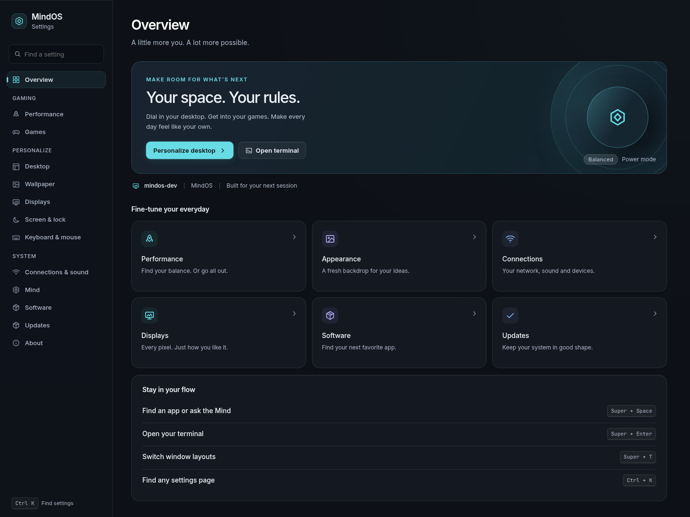
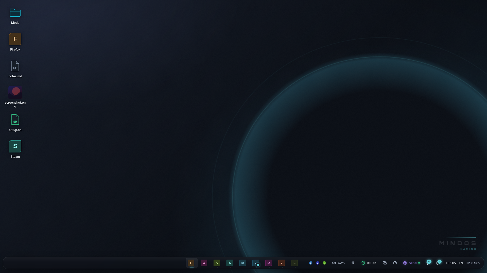
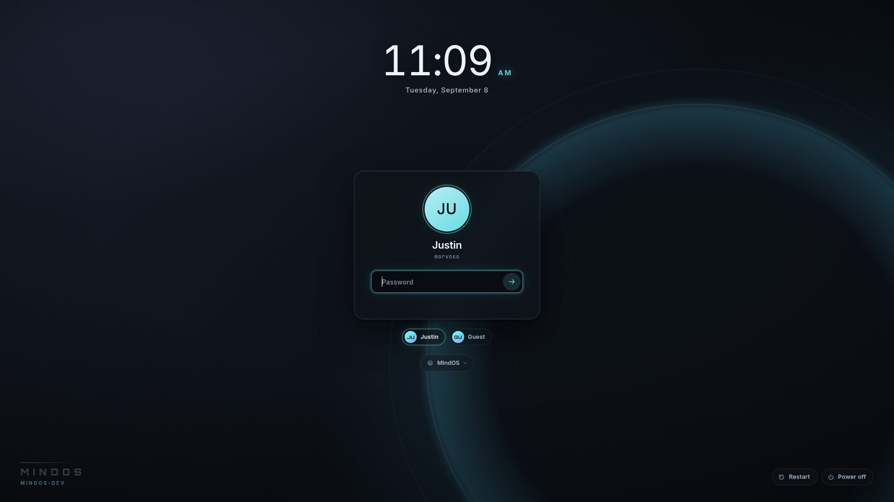
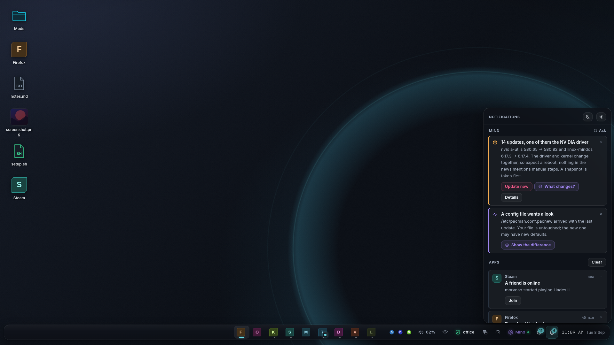

# Orbital graphite UI

The desktop uses graphite surfaces, a static cyan orbital wallpaper, a floating
bottom shelf, quieter highlights and readable Inter typography. Settings has a
new overview, grouped searchable navigation, quick links and a native terminal
action. Notifications, login, lock, widgets, dialogs, GTK applications and
compositor title bars share the updated palette. JetBrains Mono is used for code.

Browser previews below use the shell's mock data:

## Terminal

Kitty is the packaged default for the compositor, shell, dock, Files context
menus and live image. Its theme lives in
`packages/mindos-session/kitty.conf`, installed to `/etc/xdg/kitty/kitty.conf`.
It uses 12 pt JetBrains Mono, generous padding and the desktop's dark palette.
User configuration overrides the system defaults. Shell syntax, including
pipelines and quotes, executes inside the terminal.

## Verification

- TypeScript check and production bundle pass.
- UI smoke checks pass: search, keyboard navigation, terminal launch and error
  feedback, performance settings, software/game actions and compact layouts.
- Animated notification popups clear the shelf, including a scaled preview.
- All 62 compositor library tests and the shell configuration test pass.
- Kitty's own parser accepts the theme. A native Kitty process under Xvfb
  executed a pipeline and preserved a working directory containing spaces.
- Session and application package staging checks pass, including installation
  of the Kitty config and source/checksum counts.
- Primary, secondary and caption text tokens exceed 4.5:1 contrast against
  the raised graphite surface. Decorative accents are separate from body text.

The changes are in the source tree and package definitions, and are now
installed in the `mindos-dev` VM. Settings and the native Kitty terminal were
visually checked in its Wayland desktop through virt-manager; Super+Enter
launches Kitty successfully. The VM uses software rendering. The ISO has not
been rebuilt, and physical GPU behavior still needs hardware validation. Existing user layouts and
terminal overrides remain; modified system config files may need their
`.pacnew` defaults merged after an upgrade.

Run `npm run check`, `npm run build` and `npm run shot` in `mindshell/ui` to
rebuild the browser previews. Run `node scripts/tests/ui-smoke.mjs` from the
repository root for interaction checks. See [the theme guide](THEME.md) for
the shared tokens and configuration locations.

The pre-update VM snapshot is `before-ui-orbit-20260908`. Original guest
configuration is also saved under `/var/backups/mindos-ui-orbit-20260908`.
Actual VM captures are in `build/ui-revamp/vm-settings-kitty.png` and
`build/ui-revamp/vm-kitty.png`.
