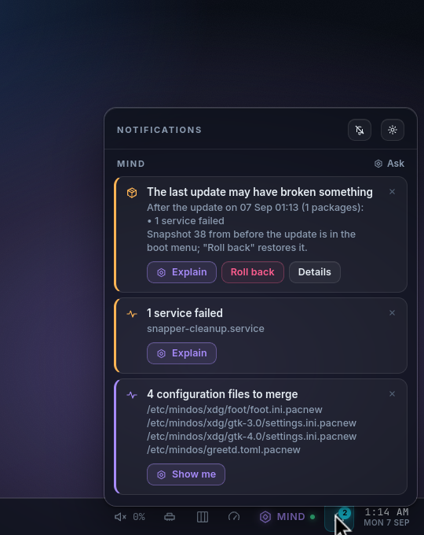
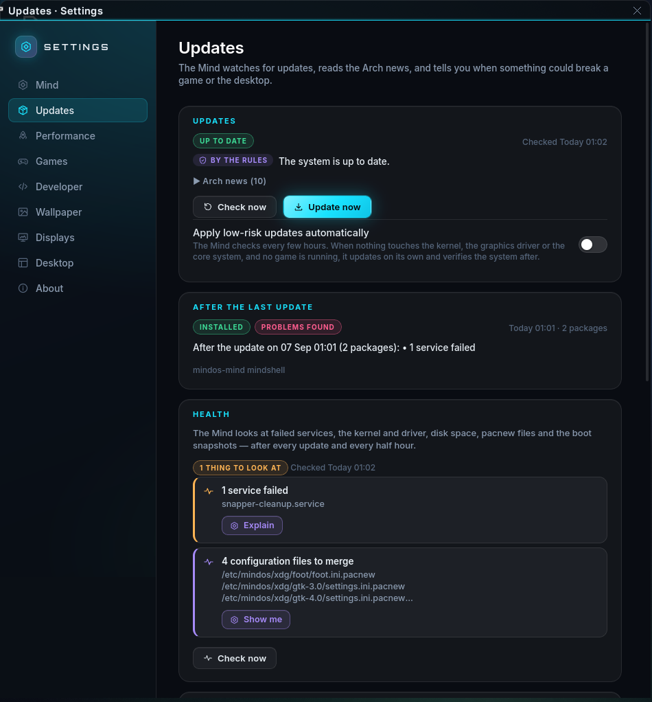

# Updates, health and the way back

The Mind (`mindd`) keeps an eye on the system so the user does not have to
read Arch news before breakfast. The pieces:

* **the update watcher** — every `check_interval_hours` (6) it runs
  `checkupdates`, reads the Arch news feed, tags every package by what a
  breakage would hit (`kernel`, `gpu`, `graphics`, `core`, `mindos`,
  `gaming`), works out a risk by rules and then asks the model for a
  short assessment (the model may lower the rules' risk by one step, never
  raise the ceiling on what auto-apply may touch);
* **notices** — what the Mind wants you to know, kept in
  `/var/lib/mindos/notices.json` and pushed to every subscriber (the
  shell shows them as toasts and in the notification centre, `mind
  notices` prints them). A notice carries actions: *Update now*, *What
  changes?* (asks the Mind), *Roll back*, *Reboot*, *Details* (a Settings
  page);
* **the pacman hook** — `96-mindos-update-mark.hook` records every
  transaction (time, packages, the pre-update snapper snapshot) in
  `/var/lib/mindos/last-update.json`, whoever ran pacman;
* **health checks** — `mind health`, every `health_interval_mins` (30) and
  a minute after every update: failed units, a kernel that is newer on disk
  than the one running, the NVIDIA module missing or mismatching the
  userspace, disk space, `.pacnew` files, kernel errors in the journal,
  the mindd socket, missing boot snapshots. Findings that need a look become
  `health:*` notices;
* **post-update verification** — after an update the health check writes
  its verdict into the last-update record and posts `updates:verified`
  (all good), `updates:reboot` (kernel or driver changed) or
  `updates:problems` with the pre-update snapshot number and a *Roll back*
  action;
* **rollback** — `rollback { snapshot }` runs `mindos-boot restore N`
  (`docs/ROLLBACK.md`) and reboots; the present state is kept as a new
  snapshot so the rollback itself can be undone.

## Auto-apply

Off by default. `mind updates --auto on` (or the toggle in Settings ›
Updates) lets the watcher apply an update on its own when **all** of these
hold: the risk is `low`, no package is tagged `kernel`, `gpu` or `core`,
the news does not ask for manual intervention, and no game is running
(`/run/mindos/perf/game`). Everything else waits for a click. Either way a
snapshot is taken first (snap-pac) and the health check runs after.

## The CLI

```
mind updates [--check] [--apply] [--auto on|off]
mind health
mind notices [--dismiss ID|'*']
mind sleep on|off
mind watch                    # print every notice / update / health event as it happens
```

## Protocol (`/run/mindos/mind.sock`)

Requests: `subscribe` (then every notice, update status and sleep change
arrives as an event), `notices`, `dismiss_notice { id }`, `updates
{ check }`, `apply_updates`, `set_auto_update { enabled }`, `health`,
`set_sleep { sleeping }`, `power { action }`, `rollback { snapshot }`.
Events: `notices`, `notice`, `notice_gone`, `updates`, `health`, `sleep`.
The full types are in `mindd/src/proto.rs`; the shell's view of them in
`docs/SHELL.md`.

## Config (`/etc/mindos/mind.toml`)

```toml
[updates]
check_interval_hours = 6
assess = true              # ask the model, not only the rules
auto_apply = false
health_interval_mins = 30
last_update = "/var/lib/mindos/last-update.json"
```

## In the desktop

The bell on the bar counts application notifications plus the notices
that need attention; the notification centre lists both, with the notice
actions as buttons (the risky ones — roll back, reboot, update — ask for a
second click). New ones slide in as toasts at the top right. Settings ›
Updates shows the pending packages with their tags, the assessment, the
news, the last update with its snapshot and a *Roll back* button, the health
findings, and every snapshot with *Restore*.




